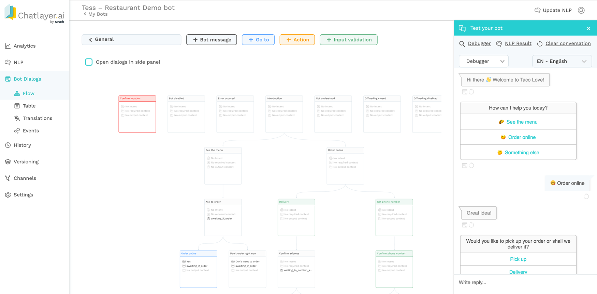

# Welcome

This documentation explains you how to get started on our platform, using easy-to-follow tutorials and visual guides. Within minutes, you'll be able to build a conversational bot and create advanced dialogues for personalised conversations.

Happy building!

  
Head straight to our most popular popular pages:







## Prefer to watch instead of read? 

You can find our Tutorial Video Series here:



