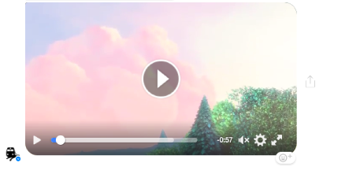
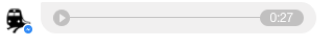
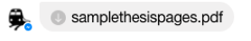
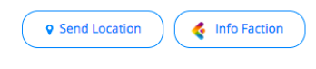
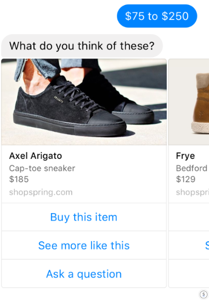
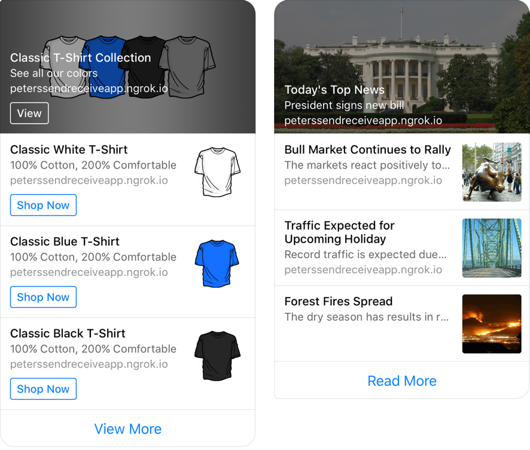
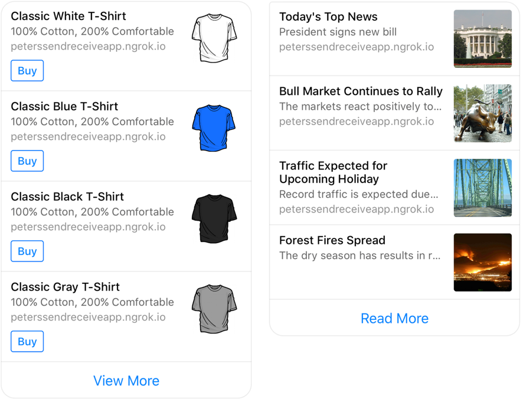

# Bot message

To design your conversational flow, you can use multiple components, like text messages, buttons and carousels. Depending on the channel you publish the bot to \(Facebook Messenger, web, Slack, Telegram, ...\), these will be shown slightly differently.


**Character limits**

When you're building your flows, our platform gives you advice on how many characters you can use in buttons, text messages, etc.

For Facebook Messenger, these are hard limits, meaning that if you're adding a button label longer than 20 characters, it will be cut off and shown with "..."   
  
For example: the label "hello I am a button click me" will be shown as "hello I am a button..."



For all other channels, the character limit is based on best practices. We recommend using less characters than the limit, but it's not mandatory.


## Text Messages 

Text messages are the most simple components. Most channels will show them as 'text bubbles'.

## Buttons

Buttons are a useful way to guide the conversation by giving the user a limited set of options. You can add a maximum of three buttons to a message.

### Button types

#### Next bot dialog

For each button, you need to define a next dialog state. Optionally, you can add key-value combinations to a button. These will set variables depending on which button the user has clicked. These variables can then later be used to route dialog states, do an API call or render specific text.

#### URL

You can link a button to an external URL.

#### Call

This button will initiate a call if the user is using a mobile device.

#### Webview

This button will open a new browser window with the configured URL as target. 

The parameters you configure for this button will be JSON stringified and appended to the URL as a Base64 encoded string. It is possible to decode this string using the `atob`  JavaScript function.

## Media

With the Media template, you can enable the bot to send files to your users.


If you upload the file directly in the platform, there is a file size limit of 10 MB. If you use a direct URL to the file, there is no file size limit.



#### Images

All typical image types, such as jpg, png and gif are supported on our platform.

#### Video

Videos are available in the Emulator, web widget and Facebook channel. The following video formats are supported:

* mp4
* ogv
* webm

A nice feature of Facebook Messenger is that people can share a video with their friends by clicking the button on the right side of the video:


Are you having trouble adding an external video to your bot? Check out [this ](https://docs.chatlayer.ai/tips-and-best-practices/solving-bot-issues/3.-media-upload-not-working)article.


#### Audio

The audio widget is available in the Emulator, the web widget and Facebook Messenger. Currently we only support MP3 as an audio format.

### 

#### Files

File attachments are available in Facebook Messenger. Currently, only PDF is supported.


We recommend media files shared on Facebook Messenger to be below 5 MB in size, as Facebook seems to have trouble in handling files larges with acceptable performance.


## Quick replies

Quick replies behave similarly to buttons. They are shown horizontally next to each other in a scrollable container. This means that you can add as many quick replies as you think necessary.

#### Payloads

For each quick reply, you need to define a next dialog state. Optionally, you can add key-value combinations. These will set variables depending on which button the user has clicked. These variables can then later be used to route dialog states, do an API call or render specific text.

#### URL

Quick replies only support next dialog states, no links to external websites. You can use a button for that.

#### Icon

Optionally, you can add an icon to a quick reply by specifying its URL.

#### Location

This button will save your location to a defined variable. Make sure to set the language for all location related data.

## Carousel

Carousels are a way to visualize options by using images. Each option can have up to three buttons with separate actions, but this is not required. These buttons are the same buttons as in the button template and use the same properties like payloads and URL, with the addition of an extra share button.


Facebook has renamed the 'Carousel' template to 'Generic Template'. You can read more about their guidelines for Generic Templates [here](https://developers.facebook.com/docs/messenger-platform/send-messages/template/generic).


#### Share button

The share button opens a sharing-dialog in Facebook Messenger, enabling people to share message bubbles \(aka carousel cards\) with their friends.

When a new user receives a message bubble, he can share it with his friends by tapping the same share button. When tapping the postback button, the user is send to the start page of the bot.

You can only use share button in generic templates items \(previously called carousels\) and only items with maximum one url can be shared by Facebook. It is not possible to change the button title: Facebook Messenger will translate the button to the user's preferred language profile setting.

## List

The List Template is a template that allows you to present a list of items, shown vertically.

Each item may shown a button that can be used as a call-to-action \(postback\). You can also provide a URL that opens when an item is tapped.

Each list template message can also have up to one global button that will show below the item list.

### List styles

Lists can be shown in two different ways: Large and Compact.

#### Large

Large lists show the first item with a cover image and text overlay. This is useful if you want to make the first item stand out over the other items.

#### Compact

Compact lists show each item in the same way. This is useful for presenting a list of items where no item is shown more prominently.

## File upload

Use the file upload template to let users upload a file directly from their device to your bot.

Configuring the File Upload as shown above will show an Upload button in the conversation:

If the upload failed because there was a problem with the connection, or the file the user chose was bigger than 10 MB, the bot will go to the "failed upload" bot dialog.

The URL where the uploaded file is stored can be found under the `{uploadedFileUrl}` variable in the user's session. You can reuse this variable to show the file that the user uploaded by using the [Media](message-components.md#attachments) template. Alternatively, you can retrieve the URL with an [API plugin](../../integrations/custom-back-end-integrations/) to store the files on your servers.

## Rich text

Rich text allows you to go beyond text messages and style your text the way you want it. You can also add weblinks using the rich text editor.


Rich text is only visible in the Chat Widget channel. The other channels do not support this type of text.


The rich text editor allows you to use the following styles:

* Paragraph
* Heading 1
* Heading 2
* Heading 3
* Heading 4
* Bulleted list
* Ordered list \(= numbered list\)

And format the text in the following ways:

* **Bold**
* _Italic_
* Underline

You can also add hyperlinks \(weblinks\) that either go to an external page or to a specific place in your conversation.

To hyperlink a word or sentence, select it and then click the chain icon on the right below. A popup will appear where you can put in the link address. Then click 'save'.

