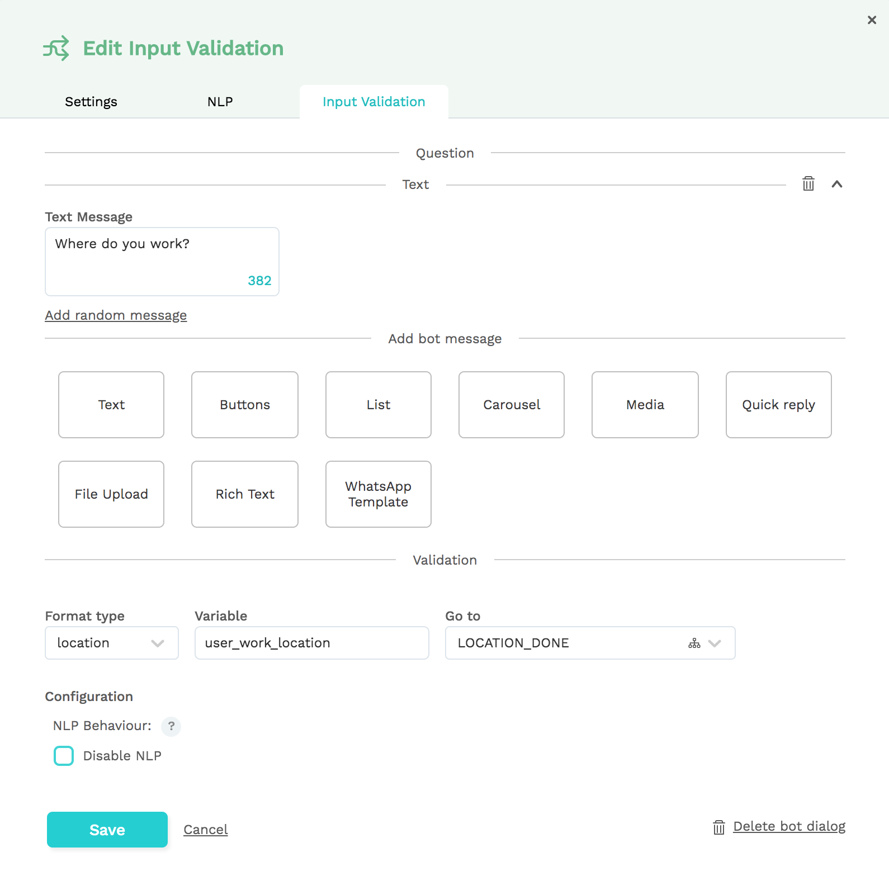

# Input Validation

An input validation dialog state can be used to get information from the bot's user. It first checks if the variable specified in the 'variable' field exists. 

If 'variable' has a value already, the bot will go automatically to the next bot dialog specified in the 'Next bot dialog' dropdown list.

If 'variable' does not have a value, the bot will ask the question as defined in the Question section.

Session variables can already be known for a number of reasons:

* The user has answered this question before
* An entity was extracted with the same variable name
* The user is authenticated and the variable was automatically set

## Invalid input

The input is invalid? You can specify the message to be displayed when input validation fails, or fails 3 times. For example: the first time a message might simply be "Can you try again?" or "Can you try DD-MM-YYYY format?" but after 3 fails, the message might be "Please contact our support at \[tel number\]" or your bot can redirect the user to a live agent.

## Settings

### Disable NLP

Users are able to leave the input validation if an intent is recognized. For bots with a very small NLP model, this might trigger a false positive. The 'disable NLP' checkbox allows you to disable the NLP model while in the input validation, which makes sure that whatever the user says gets saved as input.


### Always past - always future

Our platform parses user's expressions to match a default date format. If the date you ask should always be in the present or future, you can use these options. A user saying “Thursday” for example will be either mapped to last or next Thursday.

### Input types

Input plugins automatically validate and extract different input types based on the type setting. The type parser is responsible for extracting the data from the user's input. For example: if the input-plugin has a type of **date** and the user's input-sentence was 'I need to be in Paris _in two days_' the input plugin parser will extract the date definition from this input which results in 'in two days'. The parser will convert this into a date representation, DD-MM-YYYY, and the result will be stored in the user session.

#### Any

The 'Any' input type will accept all string values as an input. It is important to know that intents and entities are processed before parsers. This can be useful for automatically extracting certain pieces of a sentence as an answer to a question. We've got a great example of this in our tutorial [here](../../tutorials/tutorial-request-and-use-information-using-input-plugins.md).

#### Date

The Date input parser type will try to parse the response as a date. Sentences like 'next week Monday' are automatically converted to a DD-MM-YYYY date object. Supported formats \(also in other supported NLP languages\) are:

* 22-04-2018
* 22-04
* 22 apr
* 22 april 18
* twenty two April 2018
* yesterday
* today
* now
* last night
* tomorrow, tmr
* in two weeks
* in 3 days
* next Monday
* next week Friday
* last/past Monday
* last/past week
* within/in 5/five days
* Friday/Fri

#### Location

The location parser will send the user's input sentence to a Google Geocoding API service. When a correct address or location is recognized, our platform will automatically create a variable with all relevant geo-data.



Look at the bot dialog below, where we ask the user "Where do you work?" When the user answers that question, an object containing information about the location will be stored as a `user_work_location` variable. Below is an example that shows how the `user_work_location` variable would be stored when the user responds with 'Chatlayer.ai':

```javascript
{
    fullAddress: "Oudeleeuwenrui 39, 2000 Antwerpen, Belgium",
    latitude: 51.227317,
    longitude: 4.409155999999999,
    streetNumber: "39",
    streetName: "Oudeleeuwenrui",
    city: "Antwerpen",
    country: "Belgium",
    zipcode: "2000",
}
```

A bot message configured as:

`Thank you, shall I send your package to {user_work_location.fullAddress} then?`

Will show the following message to the user:

`Thank you, shall I send your package to Oudeleeuwenrui 39, 2000 Antwerpen, Belgium then?`

#### Number

Number will parse any number the user has given.

#### Hours

This input type will parse and validate timestamps.

#### Currency

This input type will parse and validate currencies.

#### E-mail

This input type will parse and validate email addresses.

#### Postal code

This input type will parse and validate zip codes. Note: currently we only support Belgian zip codes.

#### **Image**

The image format type allows you to check if a user has uploaded an image. Currently, this is only possible in Facebook Messenger and WhatsApp. 

For the chat widget, we recommend using the [file upload](message-components.md#file-upload) template.

#### Language

This input type will parse and validate NLP supported languages.

* English: \(en-us\): 'engels', 'English', 'en', 'anglais'
* Dutch \(nl-nl\): 'nederlands', 'Dutch', 'ned', 'nl', 'vlaams', 'hollands', 'be', 'ned', 'néerlandais', 'belgisch'
* French \(fr-fr\): 'French', 'français', 'frans', 'fr', 'francais'
* Chinese \(zh-cn\): 'Chinese', 'cn', 'zh', 'chinees'
* Spanish \(es-es\): 'Spanish', 'español', 'es', 'spaans'
* Italian \(it-it\): 'Italian', 'italiaans', 'italiano', 'it
* German \(de-de\): 'German', 'duits', 'de', 'deutsch
* Japanese \(ja-jp\): 'Japanese', 'japans', 'jp', '日本の
* Brazil Portugese \(pt-br\): 'Brazil Portugese', 'Portugese', 'portugees', 'braziliaans portugees', 'português'

#### **Voice message**


Use the Voice message input type to save whatever is said to the bot in a voice channel as text. You can configure the maximum duration of this voice message, and how long it takes for the bot to regard the message as "complete".

