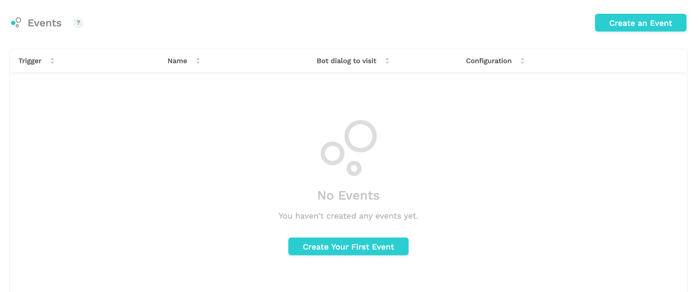

# Events

Chatlayer.ai Events are used to trigger a flow, based on an event that happens for a certain conversation. Multiple types of events allow for widely varying use cases.

To add an event, go to the Events module under Bot dialogs

Create a new event and give it a name. In the dropdown, select which type of event you want to create.

## Variables changed event

This event allows you to guide the user towards a specific flow whenever a variable is changed. While creating a new “variables changed” event, you can select:

* Which variable do you want to watch
* Which bot dialog should be triggered whenever this variable changes

Whenever the variable is changed, for example in a go to, when a button is clicked or when an entity is detected, the event will be triggered. If the bot dialog triggered by the event has multiple messages, or connects to other bot dialogs with a go to, all of these will be shown.

If the bot dialog from where the variable was changed connects to other bot dialogs, these will be shown after the bot dialog of the event.

In this flow, for example, a variable is changed in a quick reply in the “Change variable” bot dialog that triggers an event. This event triggers the “Event triggered” bot dialog, which has a “Go to” that points to “Event triggered step 2”. After these messages the flow is redirected to the "Send back after event" action, where the following configuration is placed.

This results in the following flow:

The changed variables are also stored in the user session, where you can access them in the `events.variablesChanged` array.

Chatlayer.ai customers often use the variables changed event to perform an API request through an [API action](../integrations/custom-back-end-integrations/) whenever a specific variable changes.

## Silence detected event


The silence detected event is only visible when you have the voice channel enabled for your account. 


This event allows you to configure where the user should be routed if the bot detects a silence longer than a value that you can choose.

