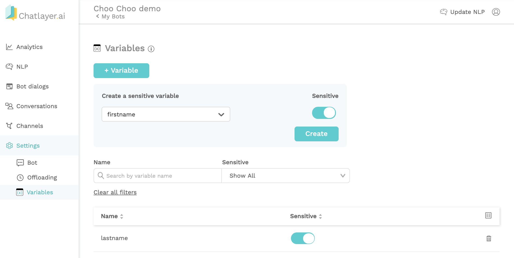

# Variables

Variables are used to store any information the bot knows about a user. This can be their preferred language, or the channel they're using, but also information coming from external data sources like, for example, an API. All variables are stored in what is called a user's **session**.

## Sensitive variables - GDPR

Our platform allows you to make sure that variables are never stored. This is useful when the conversation between a bot and a user contains **sensitive information**, such as the user's bank account number. Sensitive data should not be stored at an external provider as it is against the GDPR law and other data & security policies.

To make sure variables are not stored in the database, you can click on 'Variables' in the Settings tab. Here you can add a variable to the list of variables by clicking on + Variable. 

If you put the Sensitive toggle to `true`, the content of your variable will never be stored in your database. Instead only a placeholder with the variable name is stored.

## Incrementing variable counter

If you want to incrementally increase the value of a variable, you can use the following steps:

* Define a variable, for example `variableName`, and give it a numeric value such as `0`
* At the point in the flow where you want to increment the value of `variableName`, enter variableName as the variable and `{variableName|increment}` as the value

This method will increase the value of counter by 1 each time, for example when a specific bot dialog is passed or a button is clicked.

