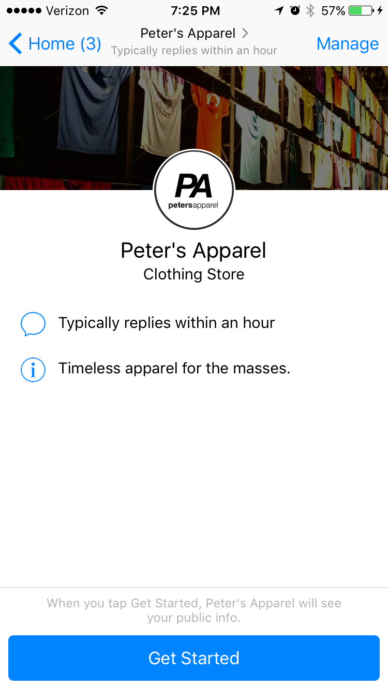
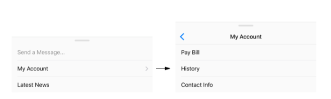

# Facebook Messenger

Integrating your bot with Facebook Messenger is easy, just follow the steps in the wizard.


In order for your Facebook Messenger bot to be publicly available, you will have to go through Facebook's strict App Review process. The steps & best practices that must be taken for App Review, as detailed by Facebook, can be found [here](https://developers.facebook.com/docs/app-review/resources/sample-submissions/messenger-platform).


## Facebook Messenger Specific Content

In the `Channels > Messenger` section you can define settings that are specific to Facebook Messenger.

### Greeting Message

The greeting message is what will be shown first when the bot is clicked on by a user. In the example below, the greeting message is configure to `Timeless apparel for the masses`.

#### Personalization

You can personalize the greeting text using the user's name by using these template strings:

* `{{internal.user_firstName}}`
* `{{internal.user_lastName}}`
* `{{internal.user_fullName}}`

### Get Started Button

Facebook has a `Get Started` button visible on every page. Clicking that button redirects you to a bot dialog which you can choose here. Typically, this is a bot dialog introducing the bot and what it can do for the user.

### Persistent Menu

Both Facebook and the web widget support an overflow menu that is called the `Persistent Menu`. In this menu, you can define common actions that your users can take. Typical examples include for example

* Start over
* Talk to a live agent
* Disable notifications
* Buy product \[XXX\]
* Go to \[company\] website
* Change Language
* Help

