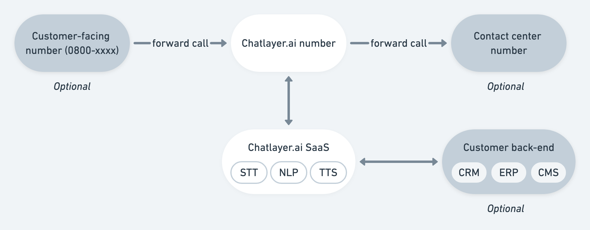

# Phone & voice

We see a voice bot as nothing more than an extra layer on top of your chatbot. You can reuse your existing chatbot, and Chatlayer will handle the speech-to-text \(STT\) and text-to-speech \(TTS\). Configuring voice in Chatlayer.ai is a matter of minutes, and we've created some custom components to make configuration easier.

Activate your Chatlayer.ai phone channel by going to the Channels tab, and clicking the + icon next to Phone.

## Architecture

### Testing

If you want to test out a first version of your voice bot, before going to production, you can use the Chatlayer.ai test number. Before you can use this test number to call your bot, you have to your number to the bot, so Chatlayer.ai knows which bot you're trying to talk to.

Click the Create Configuration button to set this up. The Chatlayer.ai test number will be shown on top of the Phone configuration screen.

### Production

When you're ready to move your bot to production, [get in touch](../support/get-in-touch.md) with us. We will set up a phone number for your bot specifically which can be used to forward calls to or be called directly. A typical phone architecture looks like this:

## Voice-specific Chatlayer.ai components

### Silence detected event

If you want to trigger a certain flow when the user is silent for a set time, use the event described [here](../bot-answers/events.md#silence-detected-event).

### Voice message format type for input validation

You can save whatever it is the user is saying as a variable by using the voice message format type in an input validation. Read more [here](../bot-answers/dialog-state/user-input-bot-dialog.md#voice-message).

### Actions: forward call & close call

These actions are available when you configure the voice channel and will allow you to:

* Forward a call to a number of your choosing, often used to handover a customer from the bot to a live agent,
* Close the call by hanging up.

