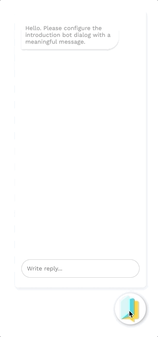

# Chat widget

One of the most common ways of making a bot available to your clients is through a chat widget. In this technical guide, we will guide you through the process of integrating the bot in your website.

## Creating your chat widget

To create a chat widget for your bot, navigate to the Channels tab and then click on the pencil icon next to Web.

Click "+ Create" to start building your first custom chat widget.


You can create multiple chat widgets for one bot, remove them, view them, and copy them using the buttons in the chat widget table.





On the Chat Widget page you can customize a number of key chat widget components:

* **Config tab**
  * Title of the bot
  * Template
  * Upload custom CSS
  * Title font & font size
  * Paragraph font & font size
  * White listing of the domains you want the bot to be activated on \(i.e. your own website domain and any other domains you use for testing\)
  * Images \(title, bot, user, send icon, SDK button - which is the image that's shown when the bot is closed\)
* **Colors tab**
  * Colors of all the key components of the chatbot
* **Translations tab**
  * Translations for the default chat widget messages such as "Write reply..."

### White listing

To make sure your bot can only be activated on your website, all your chat widgets must be whitelisted before you can use them. To do this, go to the config tab of the Chat Widget builder and add your domain names in regex format. 

An example of this regex format for https://www.chatlayer.ai: `^https:\/\/www\.chatlayer\.ai(\/|$)`

## Embedding the web widget on your website

To embed the bot on your website, start by clicking the Embed button in the top right of the Custom Chat Widget page.


There are two ways of integrating the Chat Widget on your website: you can use either **iframe** or **SDK**.

You can switch between SDK and iframe using the Type switcher above your widget:


### Should I use SDK or iframe?

Our chat widget SDK is a layer on top of an iframe, which includes some other functionalities like a button that is shown before the chat window opens, with the option to close the chatbot.

If you want to get the chat widget onto your website with minimal custom development, it's best to use an SDK. The only thing you need to do is include a HTML script tag as described below.

If you want more control over other elements, such as the chat button, it's best to use iframe.

### SDK

You can load the chat widget by using the script tag below. Calling the `chatlayer` function will show the button and your chat widget on the page.

```markup
<script src="https://chatbox.staging.chatlayer.ai/sdk/INSERT-TOKEN-HERE" 
        onload='chatlayer()' async>
    // The token can be found in the Chat Widget configuration window
</script>

```

Remove `.staging` from the URL if you want to integrate a production bot. You can add parameters to the `chatlayer` function to include additional functionality.

```markup
<script src="https://chatbox.staging.chatlayer.ai/sdk/INSERT-TOKEN-HERE" 
        onload='chatlayer({"lang":"en","animation":"grow"})' async>
</script>
```

In this case, your bot will be opened in English, and when a user clicks the SDK button, it will be opened with the Grow animation.



#### SDK Options

| Property name | Type | Remark |
| :--- | :--- | :--- |
| `withCloseButton` | `boolean` | The close button allows customers to close the bot clicking an "X" icon at the top right of the chat widget |
| `autoOpen` | `boolean` |  |
| `noButton` | `boolean` |  |
| `session` | `object` | Add data to the session which can be used to guide the flow. |
| `sessionId` | `string` | A session ID can be used to continue the conversation after the user has left the page. Make sure it's 20 characters or longer. |
| `language` | `string` |  |
| `button` | `HTMLElement` |  |
| `wrapper` | `HTMLElement` |  |

#### Transferring a variable to the SDK

If you want to transfer data from your website to the chatbot, you can add that data to the `chatlayer` function. All data will be put onto the `root.session` variable in the Chatlayer.ai session. This data can then be used to customize the chatbot flow, based on actual website data.

```markup
<script src="https://chatbox.staging.chatlayer.ai/sdk/INSERT-TOKEN-HERE"
 onload='chatlayer({session: {number: 1234, firstName: "User", lastName: "Name" }})' async>
</script>
```

Transferring the variables `firstName` and `lastName` to the SDK allows you to set the corresponding internal Chatlayer session variables. These specific variables decide how the user will show up in the Chatlayer conversations table.

```javascript
internal: {
  ...
  user: {
      firstName: 'User',
      lastName: 'Name',
        },
        ...
    },
    ...
 session: {
     number: 1234,
     firstName: 'User',
     lastName: 'Name'
    }
    ...
    firstname: 'User',
    lastname: 'Name'
}
```

#### User authentication with the chat widget SDK

In a lot of cases it's required to know **who** is talking to the bot. One way to find out is by sending a login ID, detected on the website your user is logged in, and passing it on to the bot, when the SDK is initialized:

```markup
<script src="YOUR_CHATWIDGET_URL" 
onload='chatlayer({ sessionId: LoginID }})' async>
</script>
```

This login ID can later be reused to perform calls with the [API plugin](../integrations/custom-back-end-integrations/).

#### Chat widget button behaviour

If you import the chat widget with our SDK, you can decide when the widget opens or closes. An example:

```javascript
var chatlayerChat = chatlayer({ lang: 'en'});
// This creates a Chatlayer.ai instance and adds the icon to your webpage

chatlayerChat.open();
// Opens the Chatlayer.ai chat window
setTimeout(()=>chatlayerChat.open(),10000)
// Opens the Chatlayer.ai chat window with a predefined delay
chatlayerChat.toggle();
// Toggles between the opened and closed version of the chat widget
chatlayerChat.close();
// Minimizes the chat widget window to the button
```


Make sure that the SDK script is loaded before running these functions.


### Iframe

Embedding the chat widget in an iframe is the most straight forward embedding option. You determine how and where you place the element and you can style it as you like.

```markup
<iframe src="https://chatbox.staging.chatlayer.ai/INSERT-TOKEN-HERE?language=en"/>
```

Remove `.staging` from the URL if you want to integrate a production bot. You can change `?language=en` to any language the bot supports.

#### Defining the sender ID

If you want to recognize a returning bot user, you can send a unique sender ID for each person opening the bot, which can then be used to open the same conversation when the page is reloaded.

```markup
<iframe src="https://chatbox.staging.chatlayer.ai/TOKEN?senderId=5241bbd5-6fd8-4333-85e0-72bsdf04f4c91"/>
```

Make sure that your sender ID is 20 characters or longer.

#### Passing a variable to the iframe

A user's session can be updated at any time through the [Asynchronous Actions API](webhook-api.md#asynchronous-actions).

The same goal can also be achieved by changing the iframe url:

```markup
<iframe src="https://chatbox.staging.chatlayer.ai/TOKEN?senderId=12345TEST&session[data][first_name]=Charlie"/>
```

The example above, would result in a session containing: 

```javascript
{
   "id":"1234TEST",
   "session":{
      "data":{
         "first_name":"Charlie"
      }
   }
}
```

#### Size and position of iframe

By adding the properties underneath to your CSS, you can resize the chat widget window. You can use these parameters to make the chat widget responsive for mobile devices.

```markup
<style>
    iframe.chatlayer-iframe {
        width: 350px
        max-width: 100%;
        max-height: 560px;
    }
</style>
```

### Encryption

There are two main options for securing the chat widget. You can either verify the payload by using JWT, making sure it hasn't been tampered with, or you can encrypt the session created by the chat widget by using AES-256 data protection.


  
When you turn on the AES-256 data protection, you can only pass an encrypted token as the chat session. This token should be generated in your own back-end. The code to generate the token looks like this \(using node.js\):

```javascript
const crypto = require('crypto');
const SECRET = 'CHATLAYER_TOKEN'
const createAESToken = (payload, secret = SECRET) => {
    const iv = Buffer.from(crypto.randomBytes(8)).toString('hex');
    const secretBuffer = Buffer.from(secret, 'hex');
    const cipher = crypto.createCipheriv('aes-256-cbc', secretBuffer, iv);
    const update = cipher.update(typeof payload === 'object' ? JSON.stringify(payload) : String(payload));
    const encrypted = Buffer.concat([update, cipher.final()]);
    return iv + encrypted.toString('hex');
};
const token = createAESToken({
    exp: Math.floor(Date.now() / 1000) + 36000,
    session: {
        isAuthorized: true
    },
    sessionId: 'UNIQUE_ID_FOR_THIS_USER'
});
```

How you pass this token to the client will depend on how you are generating your html, but this server-generated token should be what is passed to the chatlayer function:`const chat = chatlayer({token: serverGeneratedToken});`

## Live example

We've created an example of how you can initialize and destroy the Chatlayer.ai chat widget through your own Javascript code.

```markup
<html>
  <head>
    <title>Chatlayer Events Example</title>
    <meta charset="UTF-8" />
  </head>

  <body>
    <button onclick="initChatlayer()">Initialize Chatlayer</button>
    <button onclick="destroyChatlayer()">Destroy Chatlayer</button>
    <br />
    <br />
    <button onclick="openChatlayer()">Open Chatlayer Widget</button>
    <button onclick="closeChatlayer()">Close Chatlayer Widget</button>

    <script>
      /**
       * This example showcases the destruction of a Chatlayer webwidget
       * by triggering the JSON builder plugin in the flow.
       *
       * The JSON builder action dialog was set up as follows:
       * https://minio.dev.chatlayer.ai/public/JSONBuilder.png
       *
       */

      let chatlayerInstance = null;

      const initChatlayer = () => {
        if (chatlayerInstance) return;
        console.log("Initializing the Chatlayer widget ...");
        chatlayerInstance = chatlayer({ lang: "en" });
        // Event types are "event", "open" and "close"

        chatlayerInstance.on("open", event => {
          console.log('OPENED');
        });

        chatlayerInstance.on("close", event => {
          console.log('CLOSED')
        });

        chatlayerInstance.on("event", event => {
          // Note the content of event here: the "action" key with value "destroy"
          // originates directly from the configured JSON Builder action.
          const isChatlayerDestroyEvent = event.action === "destroy";
          if (isChatlayerDestroyEvent) {
            destroyChatlayer();
          }
        });
      };

      const destroyChatlayer = () => {
        if (!chatlayerInstance) return;
        console.log("Destroying the Chatlayer widget ...");
        // To destroy the widget, it has to be opened first
        chatlayerInstance.open();
        chatlayerInstance.destroy();
        chatlayerInstance = null;
      };

      const openChatlayer = () => {
        if (!chatlayerInstance) {
          console.log("Please initialize Chatlayer first!");
          return;
        }
        chatlayerInstance.open();
      };

      const closeChatlayer = () => {
        if (!chatlayerInstance) {
          console.log("Please initialize Chatlayer first!");
          return;
        }
        chatlayerInstance.close();
      };
    </script>

    <!-- Note the absence of the onload prop on the following script tag. -->
    <!-- To automatically initialize the webwidget, you would add the prop: -->
    <!-- onload="initChatlayer()" -->
    <script
      src="https://chatbox.staging.chatlayer.ai/sdk/5ecbcf1514c3dc4942f05f96"
      async
    ></script>
  </body>
</html>
```

JSON builder plugin configuration:



View a live version of this code [here](https://codesandbox.io/s/chatlayer-destroy-webwidget-s0lnj?file=/index.html).


As you can see from above example, you can initialize the widget, open/close it as well as destroy it from your own code. The example shows how you can use the JSON Builder plugin to trigger a destroy event for the chat widget.

