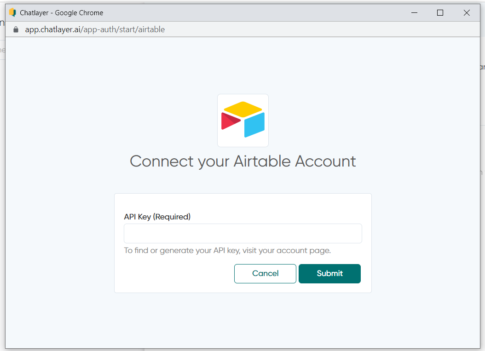
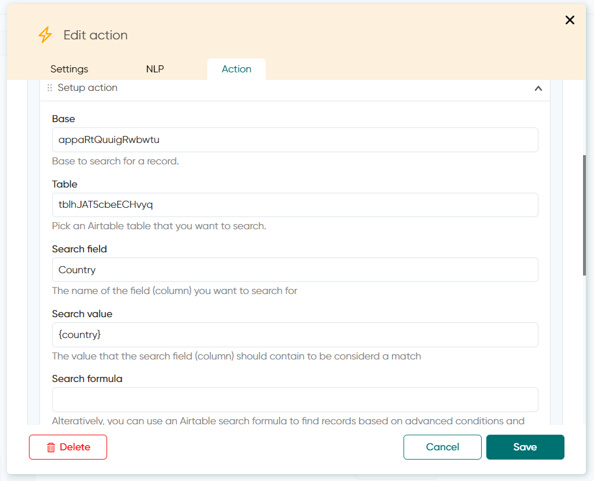

# Airtable App integration

With this integration you can search, get and update data from your database in a simpler way than creating an API.

You can connect your Airtable App in 2 ways:

A. [Via Action bot dialog](airtable-app-integration.md#a.-via-action-bot-dialog): While building your bot, in the step of the conversation flow where the table request is needed.

B. [From Chatlayer's homepage menu](airtable-app-integration.md#b.-from-chatlayers-homepage-menu): mainly before building your bot, when you know you’re going to create requests to one or more of your tables in that platform.

## A. Via Action bot dialog:

Configure your Airtable App directly via one Action bot dialog (the orange ones with a lightning icon), by clicking the option Add action > Integration:

>)

#### A.1 If there’s no Airtable app configured yet (via process B), a pop up will appear:

#### A.2 You can find your API Key in you Airtable Account page: Find out more [here](https://support.airtable.com/hc/en-us/articles/219046777-How-do-I-get-my-API-key-)

>)

#### A.3 Or you can regenerate key:&#x20;

>)

#### A.4 When clicking the API Key, you’ll be able to see it, so click, select, copy and paste it into the correspondent field of the pop-up:

#### A.5 You’ll see a new field to select integrations from:

Choose Airtable

#### A.6 On the Airtable Account field, you’ll see any Apps that you might already have created via process B, or you can create a new one by clicking the “Connect new account”:

#### A.7 And once you pick the integrated App that you already have or create a new one, you’ll see the “Select Action” field

A.7.1 You can Search, Create and Update records from your Airtable

#### A.8 Three new empty fields will appear in this screen. Here’s how you should fill them up:

A.8.1 You’ll get the information for the field “Base” from the Airtable URL. The URL syntax is:

https://airtable.com/**appXXXXXXX\[use this for “Base”]**/tblYYYYYY\[use this for “Table”]/… :

>)

A.8.2 https://airtable.com/appXXXXXXX\[use this for “Base”]/**tblYYYYYY\[use this for “Table”]**/… :

>)

A.8.3 This is what your Action box will look like once it’s filled in:

For the action you’d like to perform, fill in the Search Field (use the name of your table's column) and Search Value (a [variable ](../../bot-answers/settings/secure-variables-gdpr.md)that user will input, that should match one of the Search Field's data point) **or** create your own Search Formula\
More information on what to fill if you want to use the “Search Formula” option [here](https://support.airtable.com/hc/en-us/articles/203255215-Formula-field-reference).

#### A.9 Build your answer syntax

 (1).png>)

#### A.10 You'll know it's right when your bot fetches the right data from your table

 (1).png>)

## B. From Chatlayer's homepage menu

#### B.1 Upfront, from your left side menu on [app.chatlayer.ai](https://app.chatlayer.ai)

>)

#### B.2 When clicking “+ Add Account” button, you’ll see this pop-up:

#### B.3 You can find your API Key in you Airtable Account page: Find out more [here](https://support.airtable.com/hc/en-us/articles/219046777-How-do-I-get-my-API-key-)

\

#### B.4 Or you can regenerate key:

>)

#### B.5 When clicking the API Key, you’ll be able to see it, so click, select, copy and paste it into the correspondent field of the pop-up:

>)

#### B.6 This is what it will look like when you’ve successfully connected

>)

#### B.7 In the three dots, you can manage you app integration: 

B.7.1 Reconnect: it will open up a new pop-up allowing you to change the API Key

 (1) (1).png>)

B.7.2 Test Connection (soon)

B.7.2 Change Account Name: will open up a pop-up so you can rename your integrated App

.png>)

B.7.3 Remove: **Attention!** When clicking this button, your App integration will **immediately** be removed

 (1).png>)

If you're interested in using this integration, please request it by opening a support ticket via support@chatlayer.ai.
