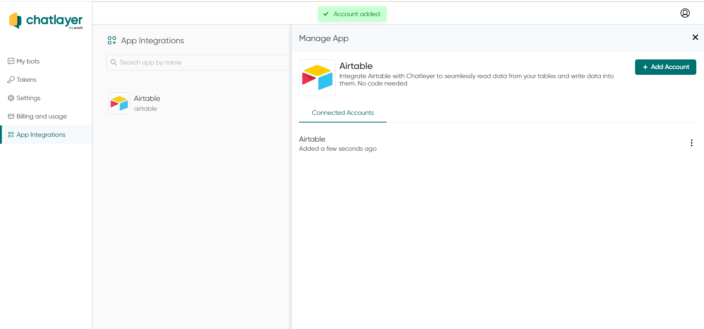
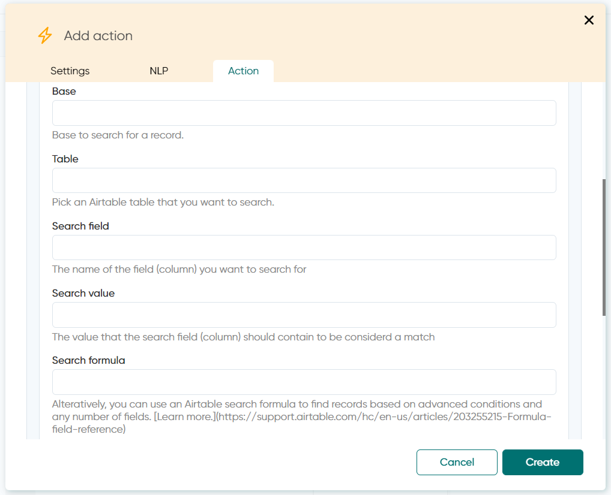

# Airtable

You can connect your Airtable Apps with Chatlayer bots in 2 ways:

A. From your left side menu on [app.chatlayer.ai](https://app.chatlayer.ai)

When clicking  anywhere in the Airtable line, the "Manage App" will open:

When clicking “+ Add Account” button, you’ll see this pop-up:

You can find your API Key in you Airtable Account page:\
Find out more here: [https://support.airtable.com/hc/en-us/articles/219046777-How-do-I-get-my-API-key-](https://support.airtable.com/hc/en-us/articles/219046777-How-do-I-get-my-API-key-)

\

Or you can regenerate key:

When clicking the API Key (purple field) in your Airtable account, you’ll be able to see it, so click, select, copy and paste it into the correspondent field of the Chatlayer pop-up:

This is what it will look like when you’ve successfully connected

In the three dots, you can manage you app integration:\

\- **Reconnect**: it will open up a new pop-up allowing you to change the API Key

\- Test Connection: (hang on tightly, we'll update this in a bit)

\- **Change Account Name: **will open up a pop-up so you can rename your integrated App

\- **Remove**: when clicking this button, you App integration will immediately be removed

B. You can also configure your Airtable App directly via one Action bot dialog (the orange ones with a lightning icon), by clicking the option Add action > Integration:

You’ll see a new field to select integrations from:

Choose Airtable

On the Airtable Account field, you’ll see the App that was created on step A, or you can create a new one by clicking the “Connect new account”:\
(If you create a new account from here, you’ll be asked the same information from Step A).

And once you pick the integrated App that you already have or create a new one, you’ll see the “Select Action” field

You can Search, Create and Update records from your Airtable

Three new empty fields will appear in this screen. Here’s how you should fill them up:

You’ll get the information for the field “Base” from the Airtable URL. The URL syntax is:

https://airtable.com/**appXXXXXXX\[**_**use this for “Base”**_**]**/tblYYYYYY\[use this for “Table”]/… :

https://airtable.com/appXXXXXXX\[use this for “Base”]/**tblYYYYYY\[**_**use this for “Table”**_**]**/… :

More information on what to fill in the “Search Formula” option: [https://support.airtable.com/hc/en-us/articles/203255215-Formula-field-reference](https://support.airtable.com/hc/en-us/articles/203255215-Formula-field-reference)

This is what your Action box will look like once it’s filled in:

