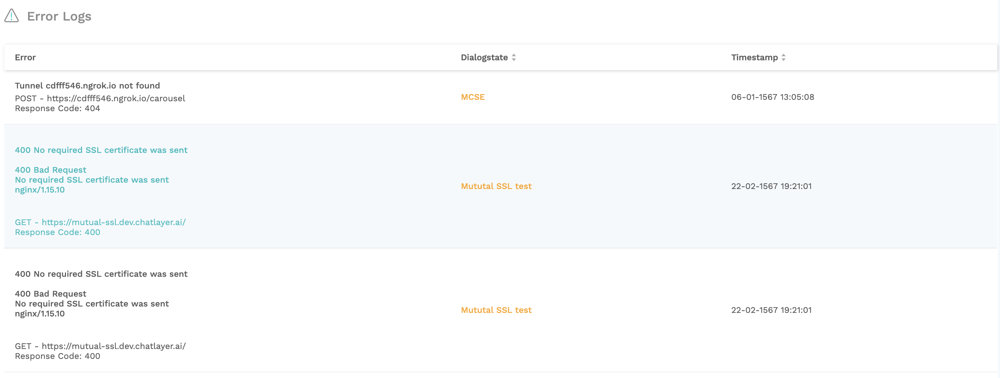

# Advanced API integrations

## API headers

Next to Query and Body parameters, Chatlayer.ai also supports API Headers in its POST, GET and DELETE requests. Headers can be added using the same combination of Key, Type and Value as the other parameters.


Make sure you include the correct content type in the header: `content-type: application/json;`


## API error logs

In the `History` menu, under `Error logs` you can see an overview of all errors that occurred with the API's you have configured in the bot.

If you click on an error you can see additional request and response information about the event that triggered the error

## API SSL settings

In the `Settings` menu under the `API` tab you can add encryption to the requests sent by Chatlayer.ai through the API plugin. 

Click on `+ Setting` to add a new encryption setting. Fill in the required fields. You can choose between the SSL and HMAC encryption types.

After creating the API security settings, you can use these settings in an API plugin.

