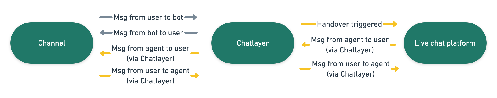
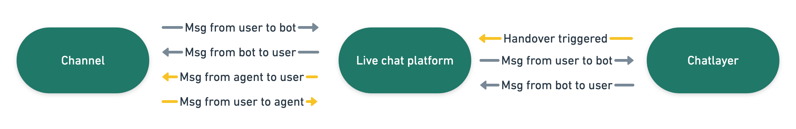

# Human handover & live chat

Bots are great as a first line of defense. However, they are not \(yet\) as smart as a real human agent worker. From our experience at Chatlayer, we have noticed that hybrid forms of chatbots in combination with live agents offer the best user experience. This is called human handover or offloading.

## When is a user handed over to a live agent?

You can configure when a user is transferred to a live agent yourself by adding a plugin called 'Send to offload provider'. When that plugin is reached, the user status will change to 'Offloaded'. The user will be transferred to one of the three predefined bot dialogs.

As long as a live agent has not taken over the chat session, the bot will remain active so the user can ask other questions and keep interacting with the bot. The live agent will have a full transcript of the chat session with the user available.

### Typical patterns that lead to a handover

Human handover, or disabling the bot and allowing a human agent to take over can happen in four situations:

* User explicitly requests talking to a live agent. E.g. by typing “I want to speak to a real agent”. This can be captured in a separate intent and bot dialog, that refers to the human handover platform.
* User reaches the ‘not understood’ bot dialog. This happens when the NLP has low confidence in the understanding of the user’s messages. This can be configured to trigger the bot to ask a question “Do you want to talk to a human agent?”
* User reaches a point in the conversation that is not supported yet. For example, this could be at the end of the ‘send paper to a new address’ conversation flow. The bot will be used to collect the necessary information and when reaching the end of the flow will be connected to a live agent for manual input in the backend system. This is already way more efficient than having the user collect all necessary information.

### Best practices

The perfect human handover integration has a few key characteristics that help the agent resolve the customer's problem more easily

* Skill-based routing: make sure that your bot can detect the type of problem your customer is having, and route the user to the right agent immediately. You can use intents for this, but buttons also work.
* Tags & variables: bots are great at gathering input. Need to know a customer's name, e-mail address and which products they bought? Have the bot ask those questions, and send that data to the agent when the customer is handed over.
* Make sure the agent can see the last messages sent between bot and customer. This will give them some context about the conversation, helping identify the problem more easily.

### Types of live chat platform integrations

There are two basic types of live chat integrations. The main difference lies in how they manage channels.

#### Chatlayer controls the channels

* The channels are directly linked to Chatlayer \(in the [Channels](../../channels/multi-channel.md) tab\)
* When the handover is triggered, the live chat platform is notified about a new conversation
* The agent takes over the conversation. The bot is put on hold.
* All messages will continue to be sent through Chatlayer, so they can end up at the right channel.
* _Examples:_ Genesys PureCloud, HelpScout, Salesforce ServiceCloud

#### Live chat platform controls the channels

* The channels are linked to the live chat platform itself
* Chatlayer is linked to the live chat platform. From the Chatlayer perspective, the only channel for this bot is the live chat platform itself.
* When a user starts talking to a channel, the conversation is sent to Chatlayer by the live chat platform.
* The Chatlayer bot sends messages back to the live chat platform, which sends the messages to the channel.
* When a conversation is handed over, Chatlayer notifies the live chat platform.
* When an agent takes over the conversation, the live chat platform stops sending messages to Chatlayer.
* _Examples:_ Zendesk Chat, Intercom, Sparkcentral by Hootsuite

## Configuring human handover

In the Settings menu under Offloading you can set-up a new offloading provider. Chatlayer supports multiple market-leading offloading providers.

The specific configuration will depend on the offloading provider you want to integrate with. Currently we integrate with the most popular offloading providers of our customers.

If you want to connect to a platform that's not in this list, try our [Offloading Webhook](offloading-webhook.md)!

## Human handover comparison

Different live chat platforms support different feature sets. Below you can find a list of what's supported by which provider.

|  | Sinch Contact | Zendesk | Sparkcentral | Genesys Cloud | \#Interact | Help Scout | Intercom | Salesforce | Webhook |
| :--- | :--- | :--- | :--- | :--- | :--- | :--- | :--- | :--- | :--- |
| Chatlayer.ai widget & channel configuration |  |  |  | ✅ |  | ✅ |  | ✅ | ✅ |
| Provider widget & channel configuration | ✅ | ✅ | ✅ |  | ✅ |  | ✅ |  | ✅ |
| Rich templates \(buttons, carousels, ...\) | ✅ | ✅ |  | ✅ | ✅ | ✅ |  | ✅ | ✅ |
| Bot history visible to agent | ✅ | ✅ | ✅ | ✅ | ✅ | ✅ | ✅ | ✅ | ✅ |
| Agent conversations in Chatlayer.ai history |  |  |  | ✅ |  | ✅ |  | ✅ | ✅ |
| Skill & language based routing | ✅ | ✅ |  | ✅ | ✅ | ✅ | ✅ | ✅ | ✅ |
| Tags & variables |  | ✅ |  | ✅ |  |  |  | ✅ | ✅ |

## Human handover bot dialogs

There are three predefined dialog states specifically for human offloading.

* **Offloading disabled**: human offloading can temporarily be disabled, e.g. due to peak an incident within the contact center. When this happens, the message in this bot dialog will be displayed.
* **Offloading closed**: message to be displayed when a user reaches the 'offloaded' state but the live chat is not open \(configurable: typically at night, lunch or weekends\)
* **Offloading opened**: temporary waiting message that is displayed once the user has reached the 'offloaded' state. Typically a message similar to "Please wait for a couple of minutes while a live agent connects to this chat session."

