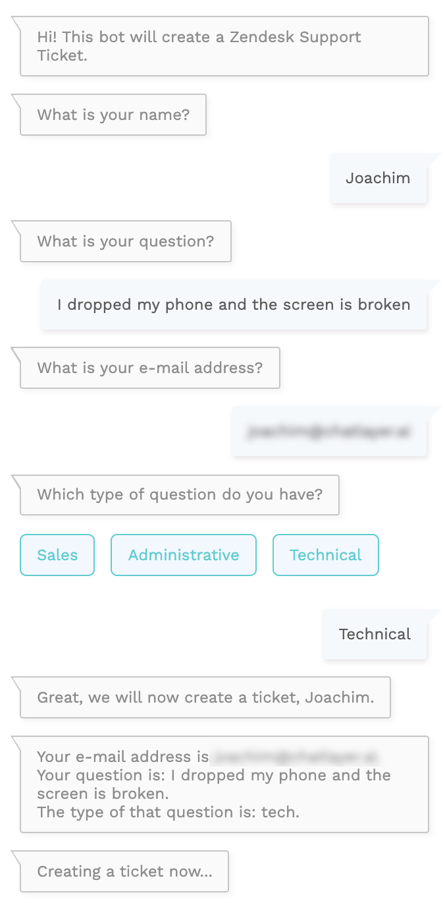
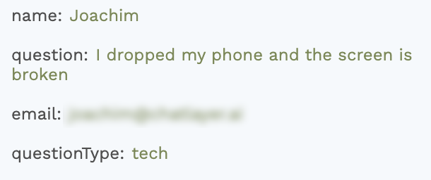
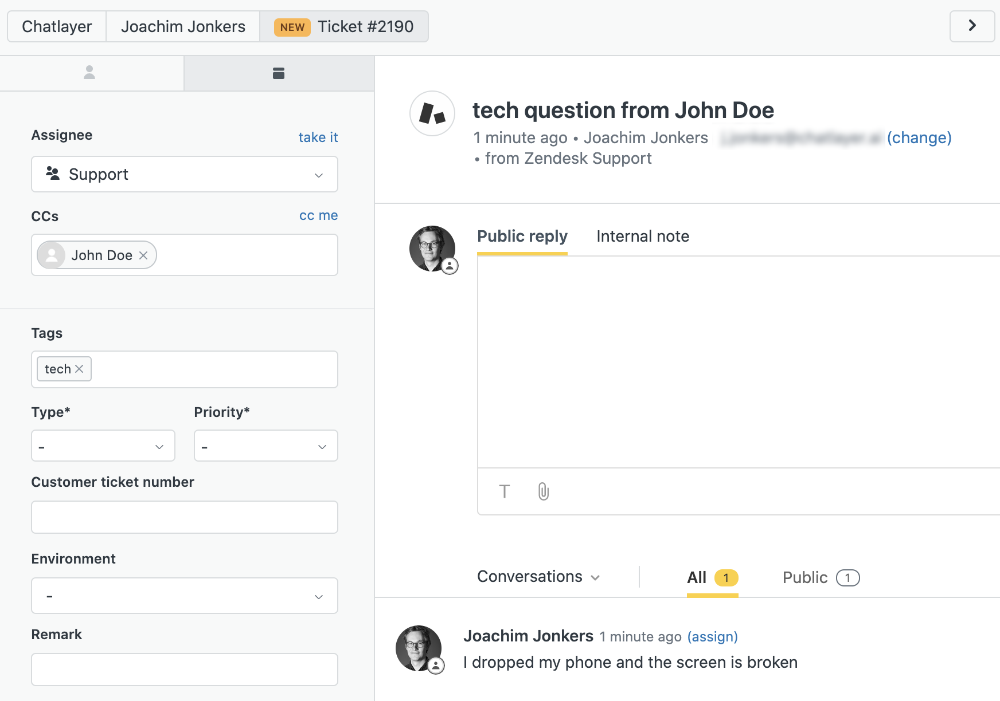

# Creating a Zendesk Support Ticket

If your organisation doesn't have any live chat agents available, you can also have the bot create Zendesk Support Tickets. This tutorial will show you how. Because of all the code it looks quite technical, but in fact it's pretty easy.


If you're new to using variables in Chatlayer.ai, follow [this](https://docs.chatlayer.ai/tutorials/tutorial-conditional-flow-navigation) tutorial first.


* Start by building a short flow that you use to gather some data about your user, for example:



* This flow adds the variables "name", "email", "question" and "questionType" to the session of the user.



* Next, go to your Zendesk account and create a new API token. More about how to create an API token [here](https://developer.zendesk.com/rest_api/docs/support/introduction#api-token).
* Create a new action that contains a Code plugin
* In our example, we want to send the customer's name, email, question and question type to the right fields in Zendesk. Furthermore, we want to jump to another bot dialog as soon as the data has been sent. Start by adding these parameters at the top of your code editor.


* Then add the code below to the plugin and save your Action dialog.

```javascript
const body = {
    "ticket": {
        "subject": args.questionType + " question from " + args.name,
        "email_ccs": [{ "user_email": args.email, "user_name": args.name }],
        "tags": [args.questionType],
        "comment": {
            "body": args.question
        }
    }
}
const zendeskResult = await fetch('https://{subdomain}.zendesk.com/api/v2/tickets.json', {
    method: 'POST',
    body: JSON.stringify(body),
    headers: {
        'Authorization': 'Basic  {in base64:{email_address}/token:{api_token}}',
        'Content-Type': 'application/json'
    }
}).then(r => r.json())

ChatlayerResponseBuilder()
    .setNextDialogState(args.nextDialogState)
    .send()
```

* Remember to fill in the right subdomain. For the authorization, you should encode your e-mail address and API token in base64 in this format: `{email_address}/token:{api_token}` \(fill in email address and api token and remove the curly brackets\). To encode it, you can use a free tool like [this](https://opinionatedgeek.com/Codecs/Base64Encoder) one.
* Et voilà! Now, every time a user goes through your flow, a new ticket will be created in Zendesk, and the user will receive an e-mail notification of that ticket as well.



* In this ticket, the tag is updated to the question type, the requester is listed in cc, the subject is a combination of the name and the type of question, and the body is the question itself.


Want to learn more about the Zendesk Create Ticket API that we're using? Read more [here](https://developer.zendesk.com/rest_api/docs/support/tickets#create-ticket).


* If there are any errors with your connection to Zendesk, you can find them in the Error logs tab under History.

