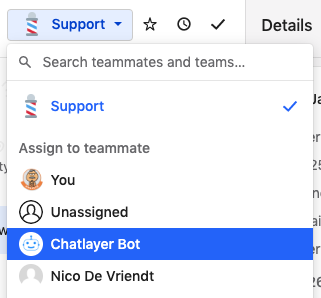

# Intercom

Intercom is a customizable messaging suite to drive growth at every stage of the lifecycle. Our integration makes it possible to assign a Chatlayer.ai bot as a teammate within your Intercom support team.

## Add & configure Intercom Channel

### Preparation

* Setup your Chatlayer.ai account and create a bot. You'll need its ID, which is in the URL.
* Setup your Intercom account and create a teammate that will act as the bot (Intercom: Settings - General - Teammates). Its also a good idea to give your bot an Intercom icon (see profile bot)&#x20;

### Add an Intercom Channel to your bot

From your bot, click on 'Channel' on the left side menu, then on 'Add Channel' and select Intercom:

.png>)

### Configure Chatlayer.ai Channel

* From the Intercom Developer Hub (Intercom: Settings - Developer - Developer Hub - App - Authentication - Access token) copy the Access token and configure it in the channel.
* Another option is: from your inbox e.g.: [https://app.intercom.com/a/apps/lzpg3ae2/inbox/inbox/5504566](https://app.intercom.com/a/apps/lzpg3ae2/inbox/inbox/5504566), you can modify the URL to [https://app.intercom.com/a/apps/lzpg3ae2/developer-hub](https://app.intercom.com/a/apps/lzpg3ae2/developer-hub)

From there, you should create a new App, as an Internal Integration

.png>)

After clicking Create App, you will be redirected to the Authentication page with your Access Token; you will need this token to connect with your Chatlayer bot.

 (1).png>)

You will also need the ID of your teammate that will acts as a bot to configure your channel.\
You find the teammate ID in the URL of a teammate Inbox:

.png>)

Copy the Access Token and Teammate Id and paste them on Chatlayer to complete your configuration. 'Intercom Client Secret' is not needed at the moment (we are working on that), please just write "test" or anything that will fill the black and allow you to Create or Update the channel.

.png>)

### Configure Intercom Webhook

From the Configure Intercom window in Chatlayer, copy the Webhook URL and add it to your Intercom's App Webhooks page:&#x20;

.png>)

In the same Webhooks page, select the following topics:

`conversation.user.created` \
`conversation.user.replied` \
`conversation.admin.assigned` \
`conversation.admin.closed`

.png>)

And finally save your Webhook. A success message should be displayed.

.png>)

## Handing over conversation between bot and agent

First you will need to configure an Offloading Provider.\
From your Chatlayer bot, navigate to Settings, Offloading and click on the "+" button to connect to Intercom. Paste your App's Access Token and choose from the list of your Bot admins, then save your configuration:

.png>)

.png>)


\
If you want to offload the conversation to an Agent on Intercom, you can use the Action Bot Dialog, selecting `"Send to offload provider"` :

.png>)

Once the `"Send to offload provider"` is added, you can select the Offloading Provider and Team to which the conversation will be assigned to. All the teams configured in your Intercom account will be listed.

.png>)

Once a conversation is handed over, the bot is placed in pause and will not answer anymore.

### Reassign an offloaded conversation back to the bot.

When you re-assign the conversation back to the bot teammate (within the Intercom app) the bot will continue the conversation.



## Specific features

### User tagging

During offloading, you can tag a user by providing the `intercom_tags` variable in the session. Separate multiple tags with commas:

```
intercom_tags=preferred, sales
```

### Using Intercom data

The following data is transferred to the bot and can be used for conditional routing or interpolation with {}

```
firstname
lastname
intercom_user_type
intercom_user_email
intercom_user_phone
intercom_user_city_name
intercom_user_continent_code
intercom_user_country_name
intercom_user_postal_code
intercom_user_region_name
intercom_user_country_code
intercom_user_timezone
intercom_user_company
intercom_user_tag_sales
intercom_user_tag_other
```

### HTML formatting

The intercom widget renders a number of basic HTML tags:

```
<b>bold</b>
<i>italic</i>
<h1>heading 1</h1>
<h2>heading 2</h2>
<a href="https://www.url-here.com">URL name</a>
```

### Introduction and Handover messages

By default, Chatlayer.ai bots start the conversation by displaying the 'introduction' message. This is not possible in Intercom, so the introduction message needs to be configured from within Intercom. (Messages - Visitor auto messages)

Same for when handing over to a human teammate, Intercom will send a message automatically, so no need to configure this within Chatlayer.ai.

## Supported message types

* Text and Media are fully supported.
* For Buttons and Quick Replies, only the text can be rendered, not the buttons themselves.
* Lists and Carousels are not supported by Intercom.
