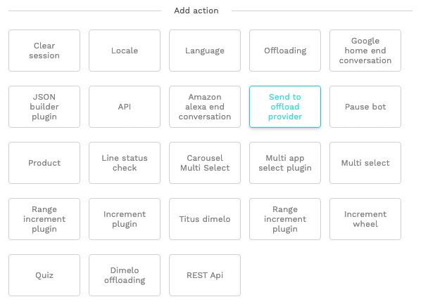

# Intercom

Intercom is a customizable messaging suite to drive growth at every stage of the lifecycle. Our integration makes it possible to assign a Chatlayer.ai bot as a teammate within your Intercom support team.

## Add & configure Intercom Channel

### Preparation

* Setup your Chatlayer.ai account and create a bot. You'll need its ID, which is in the URL.
* Setup your Intercom account and create a teammate that will act as the bot \(Intercom: Settings - General - Teammates\). Its also a good idea to give your bot an Intercom icon \(see profile bot\) 

### Add an Intercom Channel to your bot \(click on the + icon\)


### Configure Chatlayer.ai Channel

* From the Intercom Developer Hub \(Intercom: Settings - Developer - Developer Hub - App - Authentication - Access token\) copy the Access token and configure it in the channel.


* Get the ID of your teammate that will acts as a bot and configure it in the channel. You find the teammate ID in the URL when opening a teammate details:


* Finally you can click on `Create` or `Update` to save you changes.


### Configure Intercom Webhook

Add the Chatlayer.ai URL to your Intercom web hook.


Copy the Webhook URL \(Copy link\) and configure the Webhook into the Intercom Developer Hub \(Intercom: Settings - Developer - Developer Hub - App - Webhooks\)


Select the following topics


And finally save your Webhook. A success message should be displayed.

### Offloading a conversation to team

If you want to offload the conversation to a real person you can use the Action Bot Dialog.



## Handing over from and to the bot

Once the `"Send to offload provider"` is added you can select the team where the conversation would be assigned to. All the teams configured in your Intercom account will be listed.


Once a conversation is handed over, the bot is placed in pause and will not answer anymore.

### Reassign an offloaded conversation back to the bot.

When you re-assign the conversation back to the bot teammate \(within the Intercom app\) the bot will continue the conversation.


## Specific features

### User tagging

During offloading, you can tag a user by providing the `intercom_tags` variable in the session. Separate multiple tags with commas:

```text
intercom_tags=preferred, sales
```

### Using Intercom data

The following data is transferred to the bot and can be used for conditional routing or interpolation with {}

```text
firstname
lastname
intercom_user_type
intercom_user_email
intercom_user_phone
intercom_user_city_name
intercom_user_continent_code
intercom_user_country_name
intercom_user_postal_code
intercom_user_region_name
intercom_user_country_code
intercom_user_timezone
intercom_user_company
intercom_user_tag_sales
intercom_user_tag_other
```

### HTML formatting

The intercom widget renders a number of basic HTML tags:

```text
<b>bold</b>
<i>italic</i>
<h1>heading 1</h1>
<h2>heading 2</h2>
<a href="https://www.url-here.com">URL name</a>
```

### Introduction and Handover messages

By default, Chatlayer.ai bots start the conversation by displaying the 'introduction' message. This is not possible in Intercom, so the introduction message needs to be configured from within Intercom. \(Messages - Visitor auto messages\)

Same for when handing over to a human teammate, Intercom will send a message automatically, so no need to configure this within Chatlayer.ai.

## Supported message types

* Text and Media are fully supported.
* For Buttons and Quick Replies, only the text can be rendered, not the buttons themselves.
* Lists and Carousels are not supported by Intercom.

