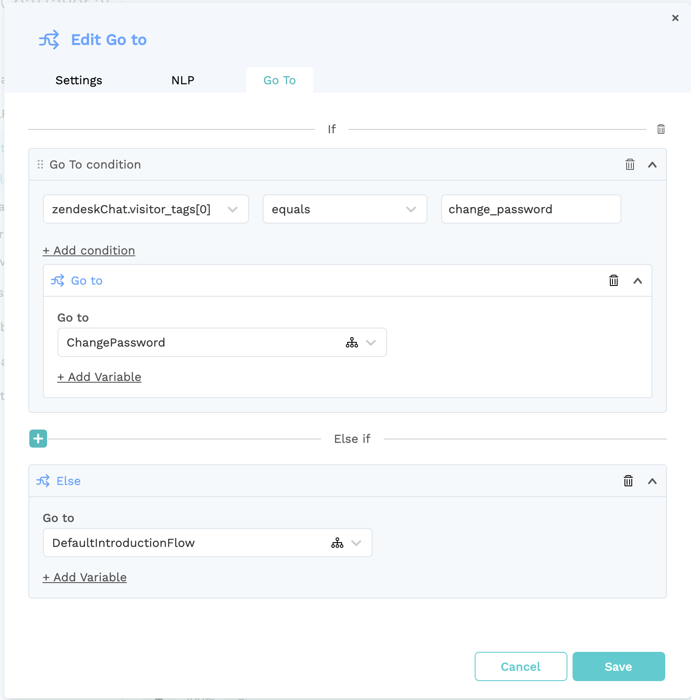

# Zendesk Chat


Zendesk only allows users on their "Enterprise" pack to use third party bot platforms such as Chatlayer. Make sure to upgrade to the "Enterprise" tier of Zendesk to use this integration.


Zendesk is a service-first CRM company that builds software designed to improve customer relationships.

## Configure Zendesk 

In Zendesk, your Chatlayer bot will be a separate agent that will handle incoming messages for its own  department. Chatlayer provides the necessary action dialogs to transfer the conversation to a department with live agents of your choosing.


The Agent account should not be accessed by live agents, as this may disrupt the chatbot. 


### Create a new agent for the chatbot

First off, create the chatbot agent in Zendesk Chat by going to Settings &gt; Agents &gt; Add Agent. 


### Create a department for the chatbot

Create a new department for the chatbot by going to Settings &gt; Departments &gt; Add Department.  Pick a recognizable name and **add the chatbot agent as the Department Agent.**


### Configure your Zendesk Chat Widget

You should now create or adjust your Zendesk Chat Widget to automatically connect to your newly configured Chatbot department. To do so, in Zendesk Chat, go to Settings &gt; Widget and copy the code below in "Embed Web Widget".


Here's an example of how you could adjust the Widget to automatically connect to the previously created **Chatbot** department:

```markup
<!-- Start of Zendesk Widget script -->
<script
  id="ze-snippet"
  src="https://static.zdassets.com/ekr/snippet.js?key=abc123
></script>
<script>
  window.zESettings = {
    webWidget: {
      chat: {
        departments: {
          select: "Chatbot"
        }
      }
    }
  };
</script>
<!-- End of chatlayerai Zendesk Widget script -->
```

Make sure to add your own key and name of the department in the code. More information on this topic can be found in the [Zendesk Chat documentation](https://developer.zendesk.com/embeddables/docs/widget/settings#departments).

## Configure your Zendesk Chat channel

In Chatlayer, go to the Channels overview to start setting up your Zendesk Chat integration. Go to the 'Channels' menu, choose Zendesk Chat and start the channel creation by clicking the + icon.

#### Finding your subdomain

You will be prompted to enter your subdomain for **zendesk.com**. 


When using Zendesk in a webbrowser, the subdomain is the first part of your Zendesk URLs. The example image below shows the subdomain "chatlayerai".


#### Authorize Chatlayer

When prompted to authorize Zendesk, log in to the Zendesk Agent account that should act as the bot agent. This is the agent you created earlier.

### Start using your bot

You can now talk to your bot through the Zendesk Chat widget. Every incoming message from a user will be answered by the bot. 

### Synchronized session variables

You can easily keep the information about your users in sync between your bot and Zendesk Chat. The following session variables will automatically be synchronized to your visitor's info in Zendesk Chat:

* `zendeskChat.email`
* `zendeskChat.displayName`
* `zendeskChat.phone`
* `zendeskChat.notes`
* `zendeskChat.tags` \(array\)
* `zendeskChat.visitor_tags` \(array, read-only\)


### Zendesk Tags

As Zendesk mentions [on their support forum](https://support.zendesk.com/hc/en-us/articles/360022366013-Understanding-different-types-of-tags-in-Chat), there are two different types of tags in Zendesk Chat:

> Zendesk Chat offers two different types of tags to categorize your visitors and chat sessions:
>
> * **Chat tags** contain information about the specific content of a chat session.
> * **Javascript API and trigger tags** contain more general information about the visitor.



Chat tags can only contain alphanumeric characters, hyphens \(-\) or underscores \(\_\). The maximum length of a chat tag is 140 characters


#### Chat Tags \(`zendeskChat.tags`\)

You can use both types of tags in your flow by using the Zendesk session variables. Chat tags can be accessed through the `zendeskChat.tags` variable, you can add more chat tags to a conversation by pushing values to that variable.

#### Javascript API and trigger tags \(`zendeskChat.visitor_tags`\)


Javascript API and trigger tags are read-only, use Chat Tags if you want to add tags dynamically through the flow.


Visitor tags can be used to pass metadata about your users' request to the bot when a user starts a conversation. Let's say you have a website with a Zendesk Chat widget and you want to start the bot from a certain intent, because the user was on that specific FAQ page. You can pass these tags to the bot from within your website's code by calling Zendesk's JavaScript SDK:

```markup
<script id="ze-snippet" src="<ZENDESK_SNIPPET_URL>"> </script>
<script>
  window.zESettings = {
    webWidget: {
      chat: {
        departments: {
          select: "Chatbot"
        }
      }
    }
  };
  zE('webWidget', 'chat:addTags', ['change_password']);
</script>
```

If you import this script on a page, every user that starts a conversation will be routed to the bot with the `change_password` tag. You could then use this tag in your flow configuration to route this user to the right part in the conversation immediately:



## Configure offloading

To transfer the conversation from the chatbot to a different department, you can create an Action dialog containing an Offload setting. Configure the Zendesk Chat offload provider and the department to which you want to offload the conversation.


Once this Action is triggered and the chosen department has at least one agent online, the chatbot will be paused and the user will be transferred to that department. The "Offloading Closed" bot dialog will be triggered should no-one in that department be online.

## Going Live

To go live, you should configure a Zendesk channel for the Live environment on [app.chatlayer.ai](https://app.chatlayer.ai). We recommend creating a separate Bot Agent, Department and Widget connected to that Department for both your Draft and Live environments. This assures no collisions will happen between your bot's versions.

Got more questions about configuring Zendesk Live chat in your bot? Do not hesitate to contact [our Support department](https://support.chatlayer.ai/)! 

