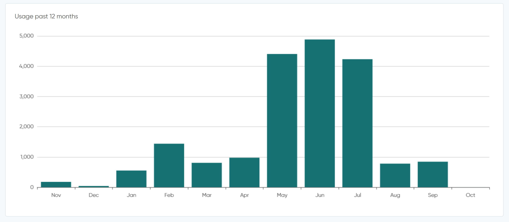

# Billing & subscription

Based on which contract you will have with Chatlayer, you will have access to certain features and have a number of conversations included with your subscription.

Each plan is based on the amount of conversations that the bot has with users. This page will explain where you can find more information about the different plans we provide, and what exactly counts as a conversation.

## Conversations

A conversation starts with a first message being sent, either by the bot or by the user. Chatlayer starts counting a new conversation when there is **no interaction between your bot and a user for at least 15 minutes.**

If the user continues the conversation on another channel, this is considered a new conversation.

Conversations where the bot sends a message, but the user does not send a message are counted. These conversations will be included in the Analytics dashboards, but not in the [Conversations](../bot-answers/user-messages.md) table.

Conversations in the "Test your bot" window will not be counted.

Conversations from both the "DRAFT" and "LIVE" version of your bot will be counted.

## Features

Some features are only included in some packs. For example, the following features are only in the Pro & Corporate plans:

* [Team roles & bot access](../organization-management/access-control/)
* [NLP Improve](../understanding-users/natural-language-processing-nlp/nlp-dashboard-and-nlp-improve.md)
* [Salesforce Service Cloud integration](../integrations/human-offloading-live-chat/salesforce-service-cloud.md)
* [Offloading webhook](../integrations/human-offloading-live-chat/offloading-webhook.md)

To see which features are exactly in each plan, check the 'Billing and usage' page in the platform.

## Billing & usage

When you log into the Chatlayer platform, you will see the 'Billing and usage' menu on the right hand side. This gives you more information about the following:

### Usage&#x20;

When you open the 'Billing and usage' menu, you'll directly get an overview of your current usage of the conversations per month in your bot.

Depending on your current plan, there may be different solutions for you when you are over your monthly conversation limit. Your Customer Success Manager can help you out if you have any questions.&#x20;

### Plans and Pricing

In the  'Billing and usage' page, you can click on the 'Change plan' button.

Here, you can find your current plan and what is included in that plan, such as how many team members and the amount of conversations per month.

If you notice that your bot is outgrowing its usage for your current plan, or if you are expanding your bot with more functionalities, this is a very useful page to see what your options are!

At the top of the page, you can see the price for each of the plans and what is included in them. If you click on 'Compare all features', an overview will open where you see all features that each plan entails. If you want more information about a certain feature, check out the documentation or contact [support@chatlayer.ai](mailto:support@chatlayer.a). If you have questions about your plan or upgrading it, please contact your Customer Success Manager.&#x20;
