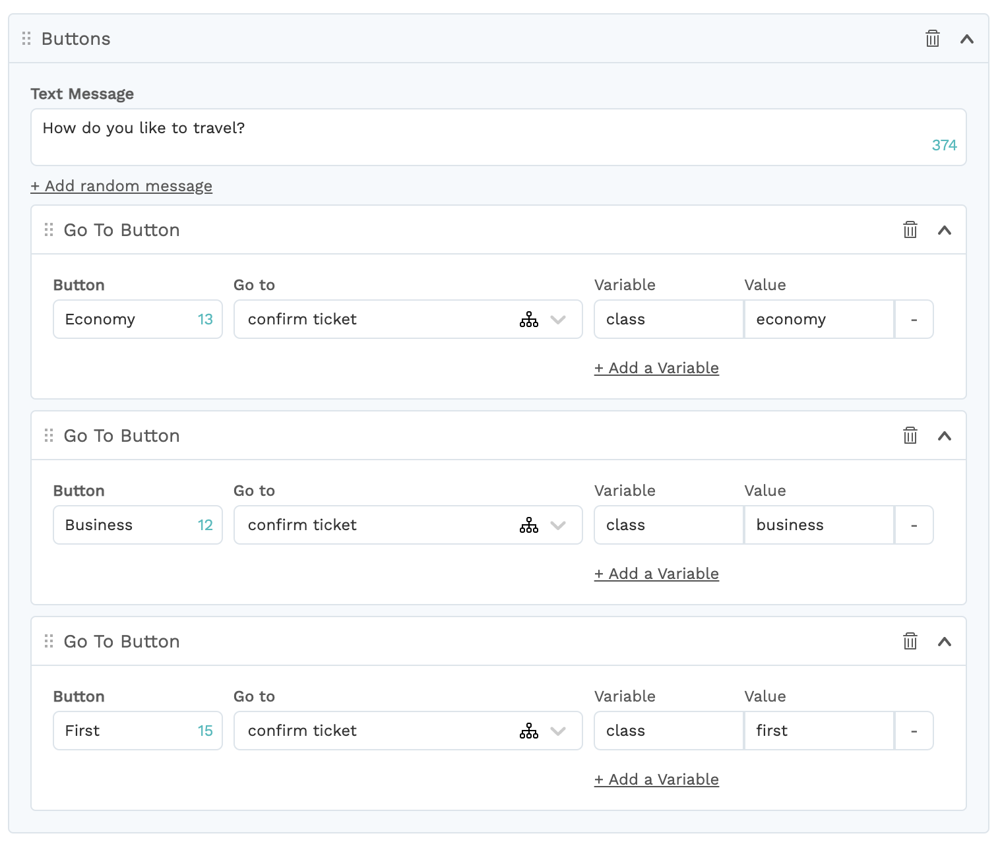
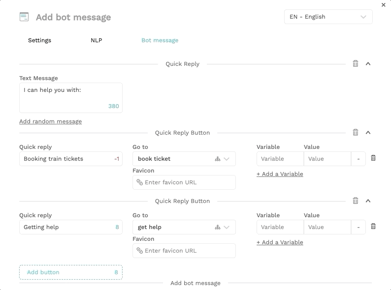
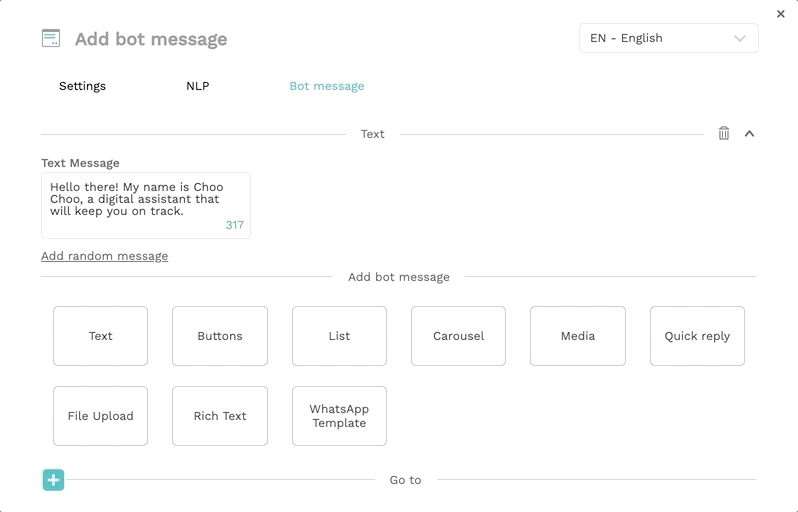

# What's new

## May 2021

* The bot name can now be seen in the tab title in your browser. Helps if you're managing multiple bots!
* New analytics - more details will follow soon.
* New way to access the platform & publish bots. Read more [here](../../bot-answers/publishing-your-bot/publishing-new.md).
* Integration with Sinch Contact to transfer a conversation from the bot to an agent.

## April 2021

* Bot templates! You don't have to start from scratch anymore. Read more [here](../../bot-answers/bot-templates.md). If you have ideas for new bot templates, [get in touch](../get-in-touch.md) with us.
* Export/import of translations table: you can now edit the translations in an exported csv, and import them once you're done. Read more [here](../../understanding-users/multilanguage-bots/translations.md).
* Integration with Salesforce Service Cloud to transfer a conversation from the bot to an agent. Read more [here](../../integrations/human-offloading-live-chat/salesforce-service-cloud.md).

## March 2021

* New role: you can add a member to a RESTRICTED bot as NLP-only now. Read more [here](../../bot-answers/user-management.md#bot-access).
* Credit card payments: you can now pay for your Chatlayer subscription using a credit card.
* Zoom controls in the Flows view

* We have reworked out Translations table to be a lot faster, and more convenient to use.

## February 2021

### New bot dialog components

We introduced a new style for the bot dialog components. Looks good, right?

This update also makes it easier to see which type of button you're creating.

### Better performance

In the background, we have switched from one database type to another, making the bots and the platform a lot faster. We will gradually move bots to this new database, so it might take a few weeks for your bot to enjoy the performance benefits.

### Team member roles & bot access

A lot of customers use bots in different parts of their organization. They have both a bot to help support their customers, as well as an internal HR bot. Often, these bots process sensitive information that should only be accessible by the team building that specific bot. That's why we have introduced team member roles & bot access.

Enterprise customers can now restrict bots to only be accessible by certain team members. Furthermore, you can set a team member as "read-only" so they can see how the bot is configured, but not change anything.

Read all about how to use team member roles & bot access:



## December 2020

We released new types of entities. You can find all information about them here:



## October 2020

### Bot import/export \(in beta\)

Save a copy of your bot in an export. Exporting a bot will result in a JSON file that you can download to your computer.

This JSON file can be imported again to overwrite a bot with the data that is in the JSON file. Read more here:



### Sorting

You can now change the order of buttons, quick replies, carousel items and go to's using drag and drop.

### Bot dialog language switching

Change the language of a bot dialog to immediately add or edit the translations for a message or button while you're creating or editing the flow.

### Rich text messages

Customize text messages the way you want them to look, and add links to other pages and bot dialogs, using rich text messages. You can read all about them [here](../../bot-answers/dialog-state/message-components.md#rich-text).

