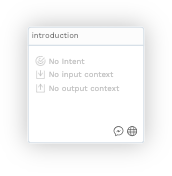
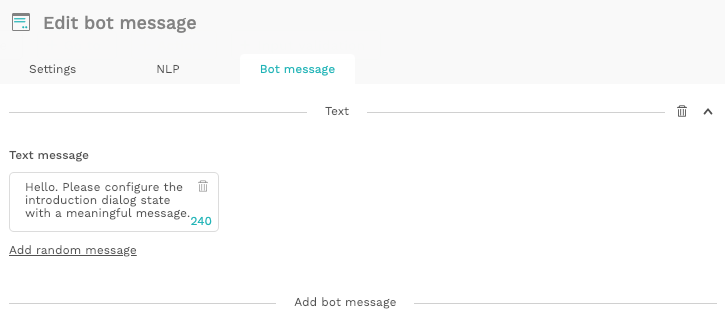
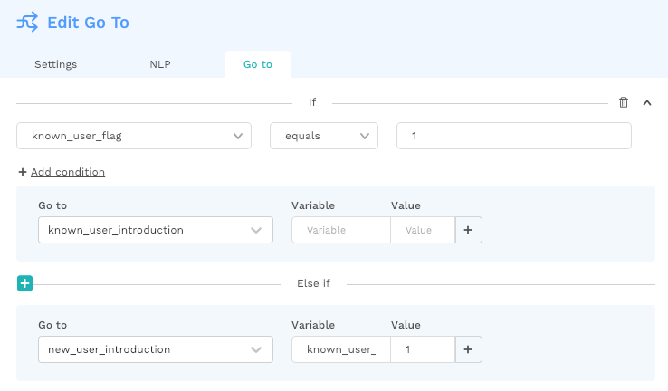
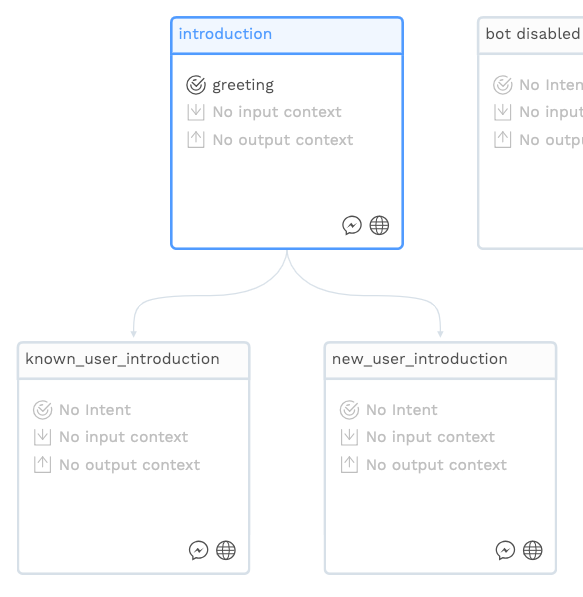
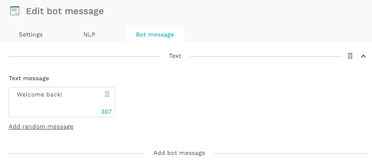
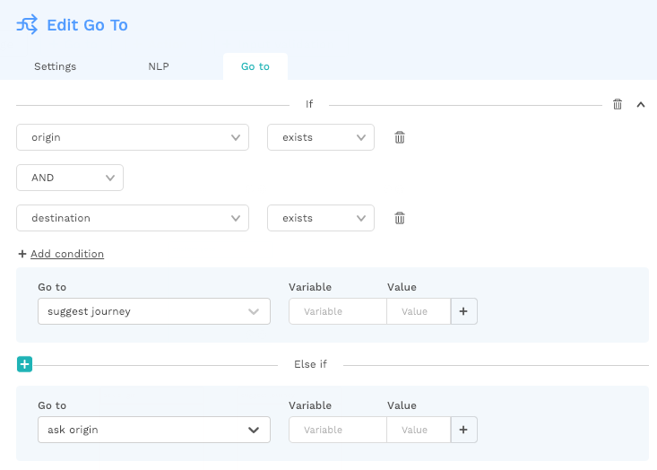
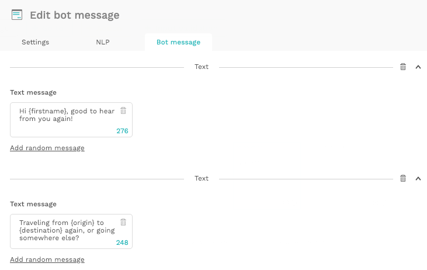

# How to recognize a returning bot user

A good bot can make users feel they're talking to a real 'artificial intelligence', with a distinct personality. However, when it starts the next conversation as if you've never met before, the illusion is gone.

Chatlayer.ai enables you to treat returning users differently, using saved variables from previous sessions.


Note that not all channels save variables the same way! 

Facebook Messenger saves them indefinitely, but by default, the Webwidget only keeps variables for the duration of the session - unless authentication of unique users is built in.


## Change the introduction to a _Go to_

Every conversation starts with the _introduction_ dialog:

By default, this is a `Bot message`:

However, instead of greeting the user right away, we can first check whether the bot has talked to him before by converting the _introduction_ into a `Go to`:

## Identify returning users with a 'known\_user\_flag' variable

Using a variable 'known\_user\_flag' \(feel free to rename in line with your naming conventions\), the bot can check whether it has talked to the user before, and redirect to the right dialogs accordingly. 

Build an If-statement as follows:

* If 'known\_user\_flag' is equal to 1, we know for certain that there has been a conversation before - else the variable would be empty - so the user can be directed to an introduction dialog appropriate for returning users.
* Else, if 'known\_user\_flag' is not defined, the user must be new, and can be redirected to an introduction for new users. At the same time, you can already set the 'known\_user\_flag' to 1, as the user is not new anymore. Alternatively, you can only change this value later on in the conversation, but changing it here is the most simple option.

## Modify flow for returning users, leveraging saved variables

Simply having a modified introduction for returning users is already of great value:

However, you can really take the bot to the next level by also using other saved variables from previous encounters.

For example, the Choo-choo bot can use previous 'origin' and 'destination' values to suggest a new journey.

You'll first want to check whether any values have been saved:

...and if so, direct to a dialog using these variables:

Used this way, saved variables can provide returning users are more personalized and efficient experience!

