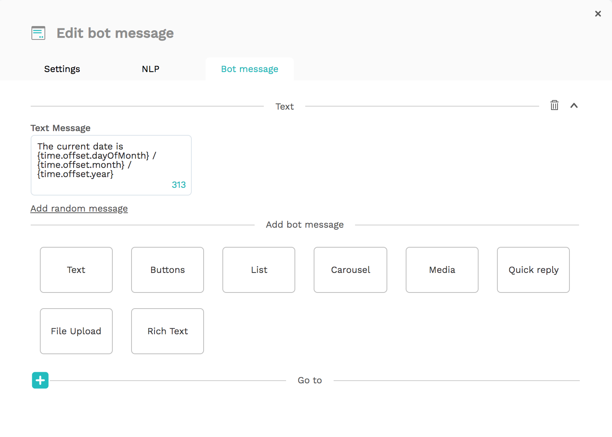

# Using time in your chatbot

The Get Time plugin on our platform guides your flow based on the current moment in time.

For example: one of our customers uses this plugin to determine if it's winter or summer, and will recommend tires based on the right season.

To implement this, first create an `Action` bot dialog that contains a Get Time plugin.


This plugin saves the current time variables to a variable of your choosing. Determine the name of this variable in the Target field. You can use it in your Go To's and Bot Messages with the following variables:

By default, the plugin result will contain some properties related to the UTC time. 

* \(target\).utc.year
* \(target\).utc.month
* \(target\).utc.dayOfMonth
* \(target\).utc.dayOfWeek
* \(target\).utc.hours
* \(target\).utc.minutes
* \(target\).utc.seconds
* \(target\).utc.ISO

When you provide a `timezone offset` to the plugin, the result of the plugin will also contain time properties that are equal to UTC+&lt;OFFSET&gt;.

* \(target\).offset.year
* \(target\).offset.month
* \(target\).offset.dayOfMonth
* \(target\).offset.dayOfWeek
* \(target\).offset.hours
* \(target\).offset.minutes
* \(target\).offset.seconds
* \(target\).offset.ISO

An example result for a time plugin with an offset of 8 hours on the October 6th, 2020 at 16:17 PM UTC was:

```javascript
{
    utc: {
      dayOfMonth: 6,
      dayOfWeek: 2,
      month: 10,
      year: 2020,
      hours: 16,
      minutes: 17,
      seconds: 44,
      ISO: '2020-10-06T16:17:44.727Z'
    },
    offset: {
      dayOfMonth: 7,
      dayOfWeek: 2,
      month: 10,
      year: 2020,
      hours: 2,
      minutes: 17,
      seconds: 44,
      ISO: '2020-10-07T02:17:44.727Z'
    }
}
```

All variables will return a number. You can use them in your flow like this:



