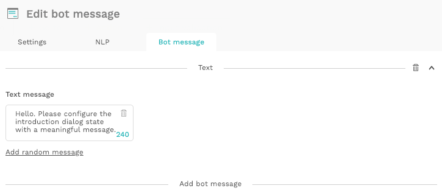
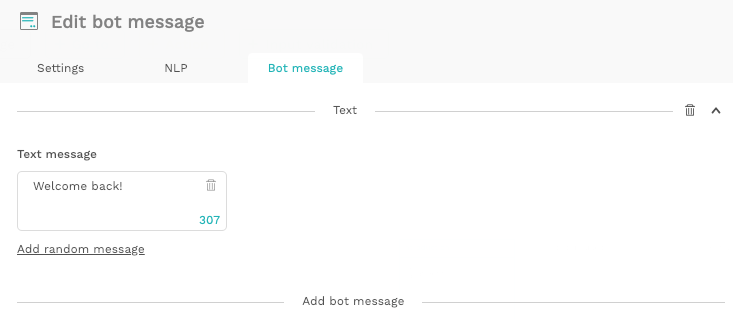
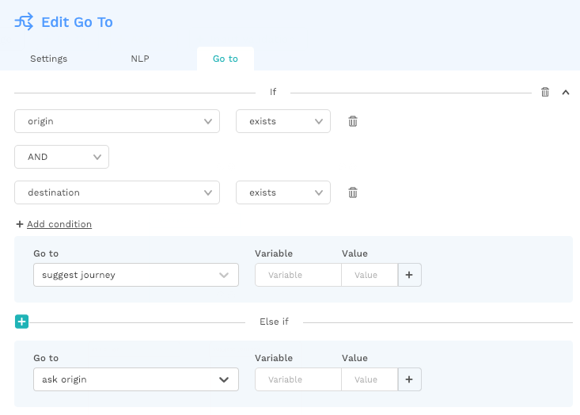

# Recognizing a returning user

A good bot makes users feel as if they're talking to another human. So when a user already talked to the bot, and your bot starts the next conversation as if it never met that same user before, the conversation feels a lot less natural and the bot appears dumb for not remembering this user. 

That is why our platform allows you to recognise and greet returning users differently, by using saved variables from previous sessions.


Not all channels save variables the same way.

Facebook Messenger saves them indefinitely, but by default, the Web Widget only saves variables for the duration of the session \(unless authentication of unique users is built in\).


## Step 1: How to convert your introduction into a go-to dialog

By know you should know that every conversation starts with the introduction __dialog:

By default, the introduction dialog is a `Bot message` where you can greet the user and start the conversation:

However, instead of greeting the user right away, you can use this dialog to first check if the bot has talked to this specific user before. To do so, you can the introduction bot message into a go-to message:


If you already wrote some text in the introduction dialog, you will lose it when converting the message into a go-to. We recommend creating a new bot message where you copy the text into, so you don't lose it.


## Step 2: How to identify a returning user

By using the variable `known_user_flag`, the bot can check whether it has talked to this specific user before, and redirect them to a personalised introduction.

To do so, you'll need to create an 'if-statement':

* If `known_user_flag` equals `1`, the bot knows that there has been a conversation with this user before, otherwise this variable would be empty. Now the user can be redirected to an introduction message for returning users.
* Else if `known_user_flag` does not exist, the user is a new user and should be redirected to an introduction for new users. At the same time, you should set the `known_user_flag` to `1` because now, the user is not new anymore. 

## Step 3: How to create a personalised flow, using known variables

Using a personalised introduction for returning users already creates a great user experience:

However, you can take the conversation to the next level by using other known variables from previous sessions.

For example, the Choo Choo bot can reuse the values 'origin' and 'destination' from previous user conversations to suggest a new and personalised journey.

Before you can use any values, you'll first need to check whether any have been saved already:

...and if these values indeed exist, the bot needs to redirect to a specific dialog, using these known variables:

This way, previously saved variables can create a truly personalised experience for returning users and make your bot look super duper smart 🤓

