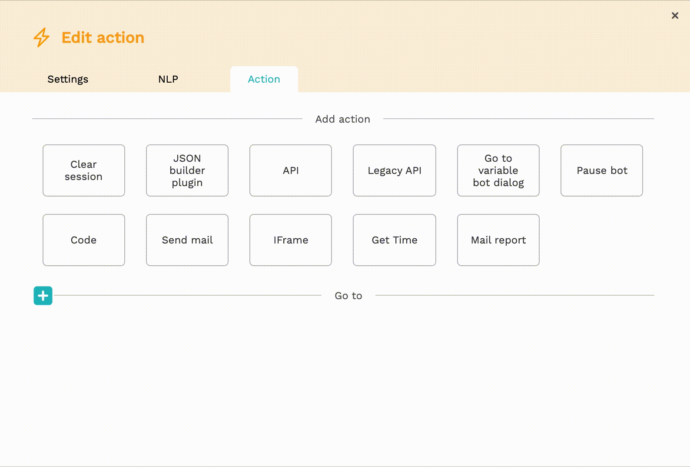

# Reusing flows

For a lot of bots built on our platform, the answer to a user's question depends on the information you know about that user. This information, such as which type of customer they are, which sort of subscription they have and so on, can be gathered through an API, but also directly in the flow itself.

For example:

.png>)

In the flow above, the answer to the user's question depends on the type of customer they are. However, the customer type is important for the answer to a lot of different questions a user might have. We don't want to show the same question every time our user asks a question like this. Instead we want to store that in one place.

In this tutorial, you will learn how to create a reusable flow, how to trigger it, and how to return to the original point in the flow.

1. Create a bot dialog that links to an intent that needs a specific answer. Link this bot dialog with a 'Go To' to the flow you want to reuse. Add a variable of the type 'bot dialog' and give it a name, like "reuseFlow." and link to a bot dialog to return to once the flow is finished.


You can create two types of variables on our platform: text variables, which allow you to store data in the session of the user, and bot dialog variables, that allow you to store a variable. \
Read more about variables [here](../tutorials/tutorial-conditional-flow-navigation.md).


.png>)

2\. Create the flow you want to reuse and gather the variables you need from the customer

3\. Add the end of this flow, add a new 'Action' bot dialog, and add a 'Go to variable bot dialog' plugin. Fill in the bot dialog variable to return to in this flow

4\. When a user reaches this part of the flow, they will return to the original bot dialog that was defined in the reuseFlow variable.

The flow used in the example above looks like this:

.png>)
