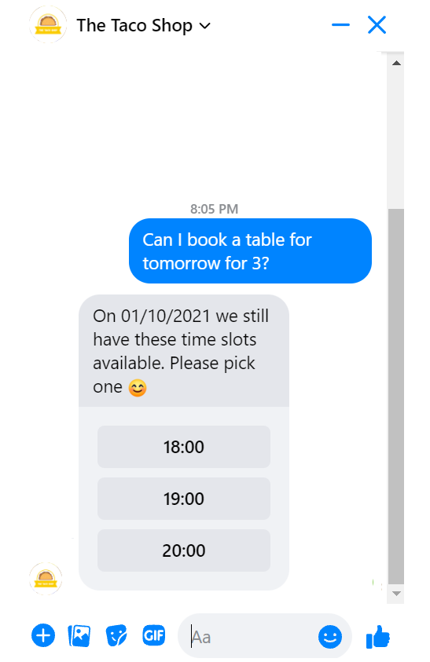

# Skip introduction message

Let's say, you have created your amazing Taco bot on Facebook. To make sure that users have the best experience possible, you are optimizing the first introduction that users see in the bot.

Wouldn't it be great if the user can immediately start typing their question, without having to click the button and wait for the introduction?

That is now possible! This article will explain the ins and outs of this feature.

## How does it work

Chatlayer will check in the first message that is sent to the bot to see if the platform can recognize an intent above the NLP threshold. 

* If an intent is recognized above the NLP threshold &gt; that linked bot dialog will trigger
* If an intent is not recognized above the NLP threshold &gt; the bot will show the introduction message 


Please note that this only works for newly created bots. Have you followed all steps and this does not work for your bot? It could be that your bot is an 'older' bot. [Contact Support](mailto:support@chatlayer.ai) and we are happy to help!


### For which channels

Some channels, such as the web widget, are initiated by the bot. Chatlayer will send the introduction message to the user when the user opens the widget or when it auto-opens, and the user will state they question and the correct flow is triggered. 

However, with channels such as Whatsapp or Instagram, the conversation is initiated by the user. The user will send a question to the bot, and that is how the conversation starts. This difference in conversation initialisation is important for this functionality, seeing it cannot be used for all channels.

The following channels have conversations that are initiated by the user:

* Whatsapp
* Facebook Messenger
* Facebook Workplace
* Webhook
* Sparkcentral
* SMS
* Instagram
* Telegram

Is your channel not listed here? All channels expect voice and web are usually able to be initiated by the user. If you are not sure, do not hesitate to contact Support. 

### Optimize your introduction further 

Want to give your users an even better first experience with your bot? Or are you not able to use this feature because you are using the web widget? 

You can personalize the introduction by [greeting the user with their name](https://docs.chatlayer.ai/tutorials-1/how-to-recognize-a-returning-bot-user), [creating a greeting based on the time of the day](https://docs.chatlayer.ai/tutorials-1/using-time-in-your-chatbot#examples) or[ set the right expectations for the user](https://docs.chatlayer.ai/tips-and-best-practices/what-makes-a-good-chatbot#2-set-the-right-expectations).

