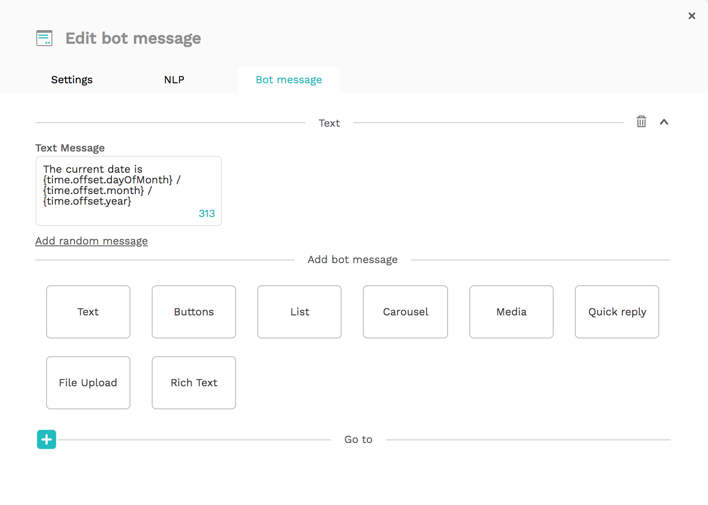

# Using time in your chatbot

The Get Time plugin on our platform guides your flow based on the current moment in time.

## Implementation

To implement this, first create an Action bot dialog that contains a Get Time plugin.

Click on 'Get Time' and fill in your target \(the name of this variable\) and the offset.


This plugin saves the current time variables to variable 'Target variable'. You can use it in your Go Tos and Bot Messages with the following variables:

* \(target\).utc.year
* \(target\).utc.month
* \(target\).utc.dayOfMonth
* \(target\).utc.dayOfWeek
* \(target\).utc.hours
* \(target\).utc.minutes
* \(target\).utc.seconds
* \(target\).utc.ISO

By default, the plugin result will contain some properties related to the UTC time. 

## Timezone

When you provide a `timezone offset` to the plugin, the result of the plugin will also contain time properties that are equal to UTC+&lt;OFFSET&gt;.

* \(target\).offset.year
* \(target\).offset.month
* \(target\).offset.dayOfMonth
* \(target\).offset.dayOfWeek
* \(target\).offset.hours
* \(target\).offset.minutes
* \(target\).offset.seconds
* \(target\).offset.ISO

An example result for a time plugin with an offset of 8 hours on the October 6th, 2020 at 16:17 PM UTC was:

```javascript
{
    utc: {
      dayOfMonth: 6,
      dayOfWeek: 2,
      month: 10,
      year: 2020,
      hours: 16,
      minutes: 17,
      seconds: 44,
      ISO: '2020-10-06T16:17:44.727Z'
    },
    offset: {
      dayOfMonth: 7,
      dayOfWeek: 2,
      month: 10,
      year: 2020,
      hours: 2,
      minutes: 17,
      seconds: 44,
      ISO: '2020-10-07T02:17:44.727Z'
    }
}
```

All variables will return a number. You can use them in your flow like this:



## Examples

Below you can find some examples on how to use time in your bot.

### Greeting

You can use the Get Time plugin to greet users in customized way, so 'good morning' and 'good afternoon'! 

First, change your introduction to a 'Go To'. Then, in that Go To, link to an Action dialog with the Get Time plugin. In that Action dialog, in the Go To section, link to a new Go To 'Check Time'. This Go To will look like this:


In this Go To, the current hour is checked and divided into the evening, afternoon or morning through the different conditions. Depending on the current time, the variable {greetingTime} is dynamic, so you can have one introduction for the entire day.


Where the complete flow will look like this:


### Offloading

The Get Time plugin can also be used to check whether or not you would like to start offloading to a human agent. Create a similar flow as the one above, but instead of the routing to the introduction in the Go To, route to the Offloading Open or Offloading Closed bot dialog based on the time:


In this case, the human agents are available from 9:00 \(if the hour is greater than 8\) until 16:00 \(if the hour is lower than 16\), and the Go To checks the time based on the previous Get Time plugin and will route the users correctly!

