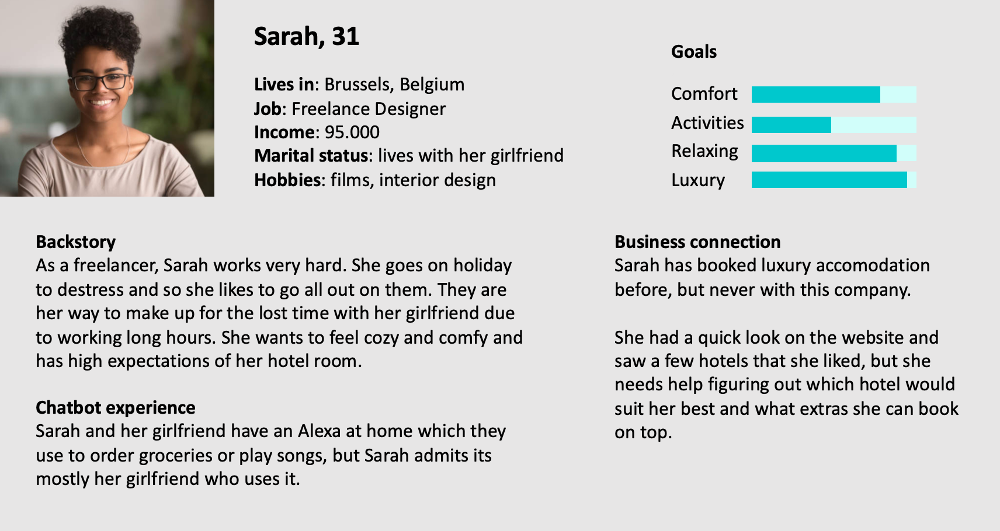

# Planning your bot

## **1. Define the bot's goal** 

Before you can start building your bot, you need to know **why** **you are building it**. What is the goal here? If you want to automate an existing service, what is the current experience like, and how could a bot help you improve it? 

Make sure to look at your business and marketing goals: if one of your goals is to increase customer satisfaction, you may want to add a bot to your customer support team and let it handle the most common FAQs, so your team has more time to focus on the complex cases.

## 2. Define the bot use cases 

After figuring out the why of your bot, it’s **time for the what**. What is your bot going to do exactly? How will it help the user? We cannot stress how important it is to figure this out **before** **you start building your bot**, as you cannot build something that isn't defined yet.

Here are some good use case examples:

* Book a table at a restaurant
* Play a song
* Find specific products
* Recommend new products
* Get directions 
* Book a flight
* Show local promotions
* Process returns

## 3. Understand your tech 

Know that you know the why and the what of your bot, it’s important to understand the where: **where will your bot live?** Will it be integrated with WhatsApp? Can customers engage with it via SMS, Facebook Messenger or on the company website? **What are the restrictions of each channel?** A bot that talks to your users via SMS won’t be able to use as many characters as a bot that only communicates via web. So make sure you understand your tech and its limitations.

> Our platform allows you to easily connect your bot to multiple channels and all your back-end databases. That's how you provide your users with a truly delightful experience.

## 4. Know your user 

In order to design an experience that feels personal, you need to make it personal. **Who is this user that will engage with your bot?** Remember, there is no such thing as a universal user! It’s important to know what users want and how they are feeling during the conversation. What’s their backstory? Their challenges? Their motivations? How familiar are they with your business and using bots in general? Our Conversation Designer likes to create a user ID that they keep close when writing the actual dialogues.

## 5. Craft your bot personality 

How can you make sure that your users connect with your bot and that the conversation is engaging and representative of real human interaction? By giving your bot a **clear** **personality**.

If you can, use your company branding as a starting point and build on it. You can read more about how to design your bot’s personality [**here**](https://chatbotslife.com/how-to-design-your-chatbots-personality-free-download-dd9eeccffbb9).

## 6. Script your happy flow 

Now that you have a clear picture of who’s communicating \(your bot persona and your user ID\) and what they’re talking about \(your use cases\), it’s time to write the **dialogues**.

**A ‘happy flow’ is** **a dialogue where everything runs the way it’s supposed to run**. The conversation is natural and smooth, and the user reaches their goal in as little steps as possible. Many conversation designers start with the happy flow because it’s the flow of least resistance. It takes the least amount of effort to script because it doesn’t include many of the inconvenient complexities that can occur.

But they will, and you need to be ready for when they do.

> **A great way to script a natural conversation is by creating a sample dialog**. Have two people sit back-to-back and improvise a conversation around a use case, with one person playing the user and the other playing the bot. Record their conversation or take notes to see which parts of the dialog still need a bit more work.

## 7. Script for edge cases 

While our AI technology is very good, it is not yet capable of understanding every user utterance well enough in order to reply in a correct way — no matter how well the script is written, in tricky situations, it will most likely fail. So after writing the happy flows, write out the most likely ways a user might go off track and how you’re going to deal with that. The sample dialog should help those pain points, as will user testing.

What if a user asks your bot how it’s doing? What if they tell the bot they don’t like it? What if they want another suggestion? What happens if the user wants to book a table for two, but one person is allergic to gluten and the other one doesn’t eat fish? 


You can find these kind of questions as prebuilt intents in our platform's NLP section. These intens are predefined and come with their own expressions, which means you can use them straight away!


Always make to strategically guide the user back to an existing flow, like in the example below:

## Time to start building

Now that you've done all the groundwork, it's time to build your bot on the Chatlayer.ai platform. Continue to our next tutorial:



