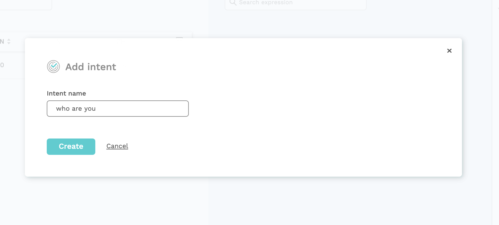
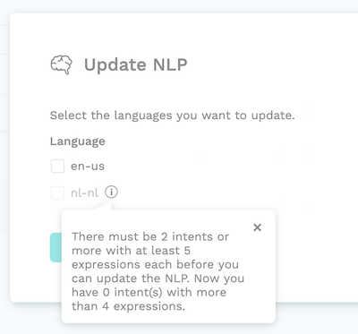

# Adding content to your bot

In the previous tutorial, we created a new bot and added a greeting. Now it is time to add some actual content. We will start with some basic bot responses to common questions asked by users.

## The NLP engine

The Natural Language Processing \(NLP\) engine is the underlying code that does the understanding of the natural language that is entered by the user.

> Understanding language isn't easy: it takes us humans about 6 years and hundreds of examples to understand the most common 20,000 words. Computers are no different. To train an NLP engine, huge amounts of data are needed. Luckily, we rely on pre-trained models that have a lot of smarts built in. The NLP engine will take care of spelling mistakes, synonyms, slang, varying word order, etc...

Since each language has its own words and grammar, we have a separate NLP engine for each language.

## Adding an Intent

An **intent** is a joint name for a specific action your user can do or a type of question your user can ask. Intents are single blocks of meaning that the NLP can recognise. For example an intent can be a question, a statement, an answer to a question or a greeting. Each intent can be expressed in many ways, that all effectively mean the same thing. We call these different ways of saying the same thing **expressions**.

Some examples of intents and expressions:

* Intent: book train ticket Expressions:
  * I want to book a train ticket
  * I need to go from Antwerp to Brussels
  * Can I order a ticket here?
* Intent: who are you? Expressions:
  * What is your name?
  * What can you do?
  * What should I call you?
* Intent: I want to leave at 9pm Expressions:
  * Can I leave at 9pm?
  * I need to take the train that departs at 9pm
  * Well, I was thinking about getting on the 9pm train.
* Intent: yes Expressions:
  * Looks good
  * Yes
  * Ok, confirm
* Intent: I want to speak to a human Expressions:
  * Can i speak to a real agent?
  * human please
  * You are a dumb bot

For our example, we want to give Choo Choo the ability to answer basic questions about itself. To get started, we will train an intent for the simple question `Who are you?`

* On the left side of the screen in the navigation menu, click on `NLP` to navigate to the NLP module. Click the `Intents` submenu.

* Click on `+ Add Intent` and name it `who are you`

### Add expression

Now, we have to train the NLP to recognise this Intent. We do this by adding Expressions. Expressions are different ways your users will express an Intent. 


Expressions are another word for what is sometimes called Utterances


The more Expressions you add to an Intent, the more accurately it will be recognised. It is crucial for an Intent to have a wide variety of expressions to give accurate results. The more expression you can think of, the better the result of the NLP will be and the 'smarter' your bot will be.

* Select the `who are you` intent in the **Intents** pane
* Click on `+ Add Expression` in the **Expressions** pane
* Enter `Who are you?` in the open text field.
* Click on `Create`

Your screen should look like this:

Add some more expressions like:

* What is your name?
* Can I know your name?
* Tell me more about yourself
* Please, I'd like to know who I am talking to
* How should I call you
* who is choo choo
* tell me what your name is
* Who are ya
* What do people call you?
* Are you a train?
* Do you have a name?

Again, the richer variety of expression you have, the more accurate your bot will respond. Later on, we will see how we can make sure that our bot gets smarter over time by looking at actual user inputs once the bot is made public.

We have built a way to create a lot of expressions really fast, by using the **expression generator**. Follow the instructions on [this page](../understanding-users/expression-generator.md) to get started.


It’s important to have a roughly equal number of expressions for each intent. Even if it usually takes more examples to train your most important intent than your second-order ones, strive to keep their number of expressions around the same amount. This helps avoid a bias towards intents with a large expression count.


### Train the model

Add another intent, like `Greeting` and add some expressions:

If two of your intents are very close in terms of expressions’ syntax or content, a good idea could be to merge them. Let’s take our example with an agent responsible for booking train tickets. You could create an extra intent for bus tickets, but the expressions in each intent would be really similar, with only the transportation mode changing from time to time. You’ll be better set with only one intent handling reservation, and an **entity** catching the requested vehicle type. We will have a look into entities in the next tutorial.

* Hi
* Hello
* Hey
* Hi there
* Good morning

We have defined two intents now. 

To update the bot, we need to re-train the NLP model.


To successfully train the NLP model, you need to have at least two intents with a minimum of 5 expressions each.


* Click the `Update NLP` button in the top right corner of the screen

Select the language you used to add the expressions.  __You can view the status of the NLP update for each language by clicking on the Update NLP icon.

Click on `Update` to start training.   
Training can take a couple of minutes up to an hour depending on the size of your chatbot. 

### Link the intent and define a response 

We have taught the NLP to understand our query, that's awesome! The only thing left now is to teach the Choo Choo bot how to respond. We can do that by adding a new Bot dialog.

* Click on Bot dialogs menu item in the navigation pane
* Open the General flow
* Click on `+ Bot message`
* Enter `who are you` as the name
* Choose the `introduction` dialog state as the parent
* Link the intent to the bot dialog in the bot dialog NLP tab.

* Go to `Bot Message` tab and add a text message that says:

> I am Choo Choo, your personal assistant for booking train tickets

Your screen should look like this:


You can view the intents linked to a bot dialog, along with input and output context in the bot dialog box.



* Click `Create`

We have defined the `introduction` bot dialog as the parent dialog state here. Parent bot dialogs do not limit or define the possible flow of the dialogue. They are a visual tool to structure the conversational flow and keep an overview. That makes it easier to create complex conversational flows. Bot dialogs can be reached from any point in the conversation by linking a bot dialog to an intent, although you can restrict them too by using Contexts. This mimics the way humans talk, jumping from one subject to another.

### Test your bot

Click on `Test your bot` at the bottom right to test your flow. To get a feel of the performance, ask the same question a couple times including ways of asking the question that are different than the expression you used to train. If a question is not recognized correctly while it should, you should go back to the `NLP` tab, add the questions as an expression, and retrain the model. You can do this as much times as needed, the model will keep on improving.


This 'Test your bot' is also referred to as the emulator.


Open de Debugger and select a user message in the `Messages` list to retrieve detailed information about the bot response message, the user funnel and context, Natural Language Processing results and user session data. 

### Multiple messages

As an exercise you can add now multiple messages on the `who are you` bot.

Update the single message to show multiple messages:

* `I'am Choo Choo.`
* `Your train traveling assistant.`
* `You can book a train ticket or ask my support.`
* `After your booking I'll keep you updated about train details so you don't have to worry about your journey.`

This makes your bot more user friendly.

### Multi-language

To configure the translations of the secondary language message and other text, go to the `Translations` module under the `Bot dialogs` tab. For more information, see the [Translations](../bot-answers/dialog-state/translations.md) module documentation.

When you have created a multi-lingual bot, you will notice that you can switch the active language in quite a few pages in the menu bar at the top, upper right. Add expressions for all intents in the secondary language \(if you have one\) in the NLP tab.

For more information and how to retrieve the user his preferred language , see the section [Multi-language bots](../understanding-users/multilanguage-bots.md).


The [next tutorial](tutorial-getting-information-using-entities.md) is about getting user input. We will ask the user for some input that is needed for booking a train ticket.


