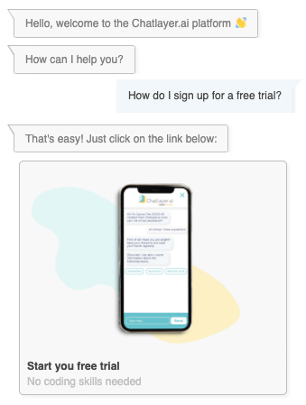

# Adding content to your bot

## The basics of bot building

In this lesson, we are going to add intents to our Choo Choo bot. We will learn about the NLP engine, how to update the NLP in your bot, and how to link intents and messages.

## The NLP engine

Before we create some more dialogs, we'd like to tell you about the NLP engine first. You see, the Natural Language Processing \(NLP\) engine is the underlying algorithm that allows the bot to understand what the user is saying. And as each language has its own words and grammar, we have a separate NLP engine for each language!

> Understanding language isn't easy: it takes us humans about 6 years and hundreds of examples to understand the most common 20,000 words. It's not so different for computers either. To train an NLP engine, we need huge amounts of data. Luckily, we rely on pre-trained models that have a lot of smarts built in already.

## Step 3: Adding an intent

An intent is a specific question from your user or an action they can do. Users will type their question in the bot, which can be recognised by the NLP engine and linked to an intent.  
  
For example: an intent can be a question, a statement, an answer to a question, or a greeting. Each intent can be expressed in many different ways, which is why we call them **expressions**.

In the example above, the user intent is "How do I sign up for a free trial?". This is then recognised by the  NLP engine, which triggers the correct response.

Here are some more examples of intents and expressions:

* **Intent: book train ticket** Expressions:
  * I want to book a train ticket
  * I need to go from Antwerp to Brussels
  * Can I order a ticket here?
* **Intent: who are you?** Expressions:
  * What is your name?
  * What can you do?
  * What should I call you?
* **Intent: yes** Expressions:
  * Looks good
  * Yes
  * Ok, confirm
* **Intent: I want to speak to a human** Expressions:
  * Can I speak to a real person?
  * human please
  * I want to talk to a human

For this tutorial, we want to give Choo Choo the ability to answer basic questions about itself. To get started, we will create an intent for the question: `Who are you?`

* On the left side of the screen in the navigation menu, click on `NLP` to navigate to the NLP module. Click the `Intents` submenu.

* Click on `Add Intent` and name it `who are you`

* Click on `Create`
* Now you see that the intent is successfully created, without any expressions added to it \(that is what the '0' means below the language\)

## Step 4: Adding expressions

Now we have to make sure the NLP recognises this intent. We do this by adding expressions. Expressions are different ways your users will express one intent. In botbuilding, as in real life, there are more ways to say something or ask a question.


Expressions are another word for what is sometimes called 'Utterances'


The more expressions you add to an Intent, the more accurately it will be recognised. It is crucial for an intent to have a wide variety of expressions to give accurate results. The more expression you can think of, the better the result of the NLP will be and the 'smarter' your bot will appear.

* Select the `who are you` intent in the **Intents** pane on the left hand side
* The **Expressions** pane will open in the right. Click on `Add Expression` 
* Enter `Who are you?` in the open text field
* Click on `Create`

Add some more expressions by clicking `Add Expression`:

* What is your name?
* Can I know your name?
* Tell me more about yourself
* Please, I'd like to know who I am talking to
* How should I call you?
* Who is Choo Choo?
* Tell me what your name is
* Who are ya?
* What do people call you?
* Are you a train?
* Do you have a name?


After you have finished your first expression, press Shift + Enter to save that Expression and immediately add a new one


This will result in the following screen:

Again, the more expressions you have, the more accurate your bot will be able to respond. Later on we'll see how we can make sure that our bot gets smarter over time; by looking at actual user input once the bot has been made public.

Let's try adding another intent and expressions:

Add another intent, like `Greeting` and add some expressions:

* Hi
* Hello
* Hey
* Hi there
* Good morning

We have defined two intents now: who are you & greeting.

However, if we were now to say 'Good morning' to the bot emulator, nothing will happen. That is because the NLP is not trained yet, and the intent is not yet linked to a bot dialog. We will work on that in the next steps.

## Step 5: Training the model

To update the bot, we now need to re-train the NLP. Updating the NLP means that the newly added intents and expressions will be recognised by the bot so we can use them in a conversation.


To successfully train the NLP, you need to have at least two intents with a minimum of 5 expressions each.


* Click the `Update NLP` button in the top right corner of the screen:

Select the language you used to add the expressions.  __You can view the status of the NLP update for each language by clicking on the Update NLP icon.

Click on `Update` to start the training. This can take a couple of minutes to one hour depending on the size of your chatbot. The more complex, the longer it'll take.

That was a great first step to use the 'Greeting' and 'How are you' intent. The next step is to link these intents in the bot dialogs. 

## Step 6: Linking the intent and defining a response

You have now taught the NLP to understand your intents and expressions, congrats! The only thing left to do is teaching Choo Choo how to respond. This means we are going to choose what the response \(or flow\) should be for each intent. You can do this by adding a new Bot dialog.

* Click on Bot Dialogs menu item in the navigation pane
* Open the General flow
* Click on the grey button on top  `+ Bot message`
* Enter `who are you` as the name
* Choose the `introduction` dialog state as the parent \(in the Settings tab\)
* Link the intent to the bot dialog in the bot dialog NLP tab as follows:

* Go to `Bot Message` tab and add a text message that says:

> I am Choo Choo, your personal assistant for booking train tickets

Your screen should look like this:

* Click on `Create`
* This will result in the folowing overview in the flow:

The image below means that a certain intent is linked to that bot dialog. 

If you now say 'Who are you' in the emulator, you immediately get the response that is typed in the 'Who are you' bot dialog.

We have defined the `introduction` bot dialog as the parent dialog state in the `who are you` bot dialog. Parent bot dialogs do not limit or define the possible flow of the dialogue. They are a visual tool to structure the conversational flow and keep an overview, which makes it easier to create complex conversational flows. Bot dialogs can be reached from any point in the conversation by linking a bot dialog to an intent, although you can restrict them too by using Contexts. This mimics the way humans talk, jumping from one subject to another.

## Step 7: Testing your bot

Time to Choo Choo! Click on `Test your bot` at the bottom right to test your conversational flow. To get a feel of your bot's performance, ask the same question a couple times, including different ways of asking the question that are different to the expression you used to train. If a question is not correctly recognized, you'll have to go back to the `NLP` tab, add the questions as an expression, and retrain the NLP model. You can do this as many times as needed, the model will just keep on improving.


The 'Test your bot' feature is also referred to as the 'emulator'.


## Lesson recap

Now, you have a bot with the following configuration:

* 2 intents \('Greeting' and 'Who are you'\) and their expressions
* A bot message 'Who are you', with the intent 'Who are you' and four text messages in it. 

You  should now be familiar with:

* Adding an intent to a bot dialog
* Creating intents and expressions
* Training the NLP to use these intents and expressions
* Adding multiple text messages in one bot message
* Testing your intent and messages in the emulator

If any of these topics are difficult for you, revisit them in the tutorial or search on the page in the top right search bar to learn more about a topic.

In the next tutorial we'll be gathering user input. Choo Choo will ask the user for input,  needed for booking a train ticket.

