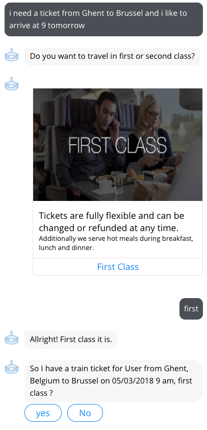

# Flow navigation with variables

The **Go To** bot dialog enables the bot to redirect the user to a bot dialog, depending on conditions of the session variables. You can define conditions with operators like `equals`, `greater than`, `smaller than`, etc. You can also combine multiple conditions with `AND` and `OR`.

Consider the following scenario where the user asks the bot the following:

> I want to book a train from Paris to London in first class please.

Define a different message, based on which class the user selected: `first` or `second` **class**.

* Create a **bot dialog** `class redirect` of type **Go To**
* Create a **bot dialog** `selected first class` with `class redirect` as a **parent**
* Open the `class redirect` **bot dialog**
* If the **variable** `class` is `equal` to `first`, we want to redirect the user to the **bot dialog** `selected first class`
  * If the condition is not fulfilled, and the user has selected `second` **class**, we want to confirm that selection
  * If the user has selected no class at all, we want to redirect the user to the **bot dialog** `first or second class`. Here, the traveler will be asked explicitly in which class they want to travel
* Configure the **Go To** like this:

* Add a **text message** in the `selected first class` **bot dialog** and a **Go To** that redirects the user to `confirm booking`
* Adjust the **Go To** settings in the **input validation** in the `first or second class` **bot dialog** to go to the **bot dialog** `class redirect`. Adjust the **Go To** in the `first class` button
* Now test your bot in the Emulator:

