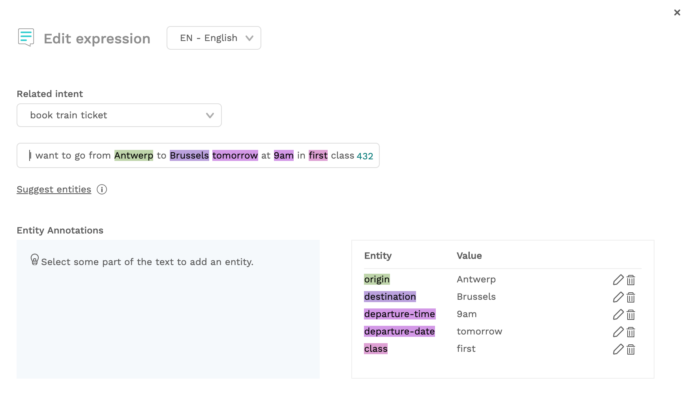

# Capture information with entities

In the Choo Choo bot, we can define a new intent that tells us that the user wants to book a train ticket by training it with expressions like:

* I want a train ticket
* I need a ticket
* Can I book a train ticket here?

But what happens when a user says something like:

* I want a train ticket to Amsterdam
* I need to go to Antwerp tomorrow
* Can I book a train ticket to Brussels please?

Those expressions contain valuable information. We want to make sure we capture the destination and store it as a variable. In this tutorial, we will see how to store data that was mentioned in intents using entities. In the next tutorial, you will see how we can ask explicitly for missing variables.

## Creating entities

Not all users will immediately give the destination, so let's make sure we train our intent without entities as well:

* Go to `NLP` &gt; `Intents`
* Add a new intent called `book train ticket`
* Add some simple expressions, like:
  * I want a train ticket
  * I need a ticket
  * Can I book a train ticket, please?


If you're having trouble doing this, feel free to take a look at the [previous tutorial](tutorial-adding-content.md).


Next, it's time to add an entity.

* Click on `+ Add expression`
* Select `book train ticket` intent
* Enter an expression that contains an entity, like:

> I want to book a ticket from Brussels to Paris

* Select `Brussels` in this sentence. 

* Click on the + entity icon in the bottom right of the expression box to create a new entity for Brussels
* Brussels is the location the user wants to depart from so we will name this entity `origin`. 
* Type `origin` in the `Create new entity` field and click the Create new entity button to confirm.

* Brussels will be added to the list of possible values for the @origin variable.
* Do the same thing for `Paris` as a destination entity.

* Add some other values for the @origin and @destination entities in the expression field. These will be saved for all future expressions.
* Add more expressions that contain the entities **origin** and **destination**.


Chatlayer.ai recommends adding at least 30 expressions per entity, to guarantee the quality of the entity detection.


* Some suggestions for expressions:
  * Can I book a train from Cologne to Brussels?
  * I need to be in Rotterdam
  * I need a train to London
  * I need to be in Lyon
  * I want to buy a ticket from Moscow to Vladivostok.
  * I need a ticket from New York to Baltimore
* Make sure you retrain the model by clicking the `Update NLP` button.

## Testing entities

After we have retrained the model, let's see if the model is good enough to recognise the destination entity.

* Go to `NLP` &gt;`Test` to open the testing console. 
* Write 'I would like to go to Brussels from Amsterdam' as the expression to be tested
* Click on `Test`.

You see that the entity gets recognized with a 89.72% confidence. Your results will be different based on your training set. If the entity is not recognized correctly, you can add it here as a training expression immediately. 


Make sure you retrain the model before testing newly added expressions.


## Using variables in messages

When a user says something with an entity, and the entity is successfully detected, Chatlayer will automatically store it as a **variable** for that specific user.

To reuse the variable later in the conversation, you can put it in between curly brackets like this: `{variable_name}`. When writing this message to the users, Chatlayer.ai will automatically substitute `{variable_name}` ****with the value of the variable. If the variable is empty, an empty string will be printed.

* In Bot dialogs, create a bot dialog of type Bot message `book train ticket` and link the `book train ticket` intent to it in the NLP tab.
* Add a new text message with the text 'So you want to go to `{destination}`, I can help you with that!'

Variables can be used everywhere throughout the platform, for example in API calls, list templates and button labels.


Not only entities can be variables. Later on you will learn how to use variables to build flows.


## Testing entities in the emulator

Now that we have linked everything, we are ready to test if everything is configured correctly by using the emulator.

* Open the Emulator \(aka `Test your bot`\)
* Enter "I want to go to Amsterdam" and submit
* Open the debugger

In the 'NLP Result' tab you can now see the entity was extracted correctly.

All entities are stored in the variables list automatically. Under the 'Debugger' tab, you can find a list of all known variables under 'User Session'. Since the entity was recognized in the previous message, this contains the variable 'destination'.


If your entity is recognised by the NLP but does not show up in the User Session, it did not pass the threshold. By default the threshold is set to 80%. You can lower it in the NLP tab, but better still is to add more expressions to your bot so that the model becomes more robust and will work better in the future.


## Multiple entities

You can add as many entities as you want to an expression. It can sometimes make sense to prepare for a lot of entities and add expressions like

* I want to go from **Antwerp** to **Brussels** **tomorrow** at **9am** in **first** class

with entities

* origin: Antwerp
* destination: Brussels
* departure-date: tomorrow
* departure-time: 9am
* class: first

Keep in mind that NLP techniques are probabilistic in nature. When you try to capture 5 expressions in one sentence, it might not recognise all of them correctly. As a general rule of thumb, you can start to expect reasonable results for one entity when the NLP was given 30 expression to learn from. 

#### Additional Expression suggestions

* I need to be in Paris next Thursday
* I need to be in New York on Friday
* I want to go to Brussels on Monday
* Friday I want to go from Antwerp to Amsterdam
* I want to travel in second class from Ghent to Brussel on Friday
* I want to travel in first class from Antwerp to Aalst on Thursday
* I like to book a first class ticket from Aalst to Brussels at nine o'clock
* Tomorrow I want to go from Antwerp to Brussels on the train from 9:00 in first class

## Missing entities

### Test your entities

Update your `book train ticket` message to display the entities.

`So I have a request for a train ticket; {origin} to {destination} on {departure-date}, {departure-time}, {class} class.`

Re-train your NLP model and test your bot.

Oops, not completely what we want. The departure date and time is not set \(your result can be different depending on your expressions\).  
  
What is the problem? Let's look at the NLP Results:

`origin`, `destination` and `departure-date` is found but only `origin` and `destination` have a confidence score above 80%. So `departure-date` is not processed and put into a variable.  
  
More expressions can help you fix this problem.

Not every user will input all the entities you might need. In the [next tutorial](tutorial-request-and-use-information-using-input-plugins.md), we will see how we can check if a user has already provided information, and ask for everything that is missing.

