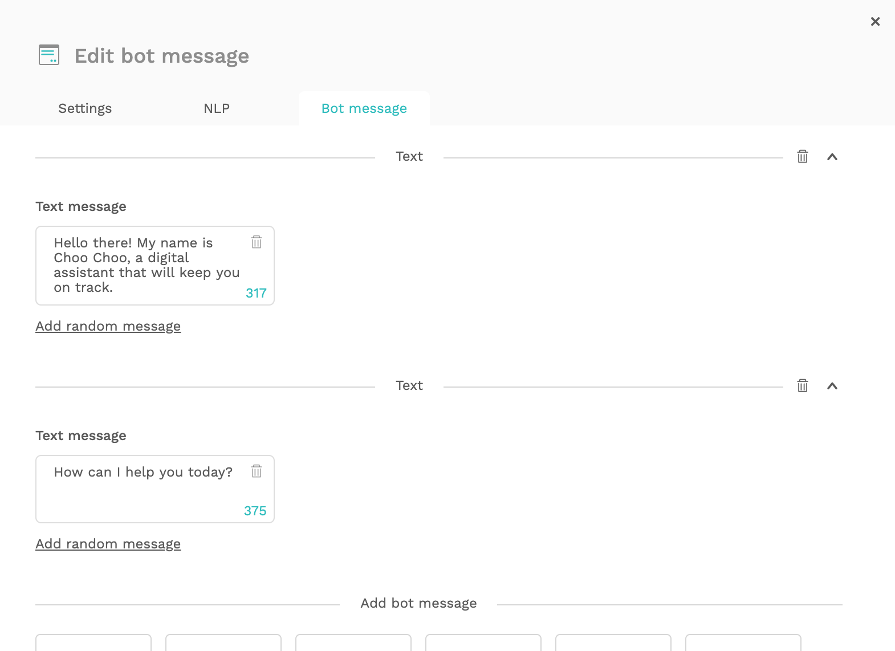

# Getting started

In this tutorial, we will introduce you to the steps needed to create a chatbot from scratch and setting up a new project. 

If you are working on an existing project, you don't need to set up a new project so feel free to skip ahead to the next tutorial.

## Create a new bot

We will create a conversational interface called Choo-choo, a digital assistant for booking train tickets.To get started, make sure you have valid credentials for using Chatlayer.ai.


If you don't have credentials yet you can contact us [here](https://www.chatlayer.ai/contact).


* Log in using your credentials on [https://cms-staging.chatlayer.ai](https://cms-staging.chatlayer.ai)
* To start, click the `+ Add bot` button to create a new bot

* Enter `Choo Choo (your first name)` as the name of the bot
* Choose `English` as the primary language. This is the language you will develop the bot in.
* \(Optional\) Add other languages if you want a multi-lingual bot.
* Click `Create` to create your new bot.


Be aware that you can't add additional languages once the bot is created. Contact our support team [here](https://chatlayer.zendesk.com/hc/en-us) to if you need to add a language on an existing bot.


Once you have created the bot, click on the pencil icon to start creating your bot.

In the menu on the left, click on `Bot dialogs`. Enter the `General` flow by clicking the flow icon 


Flows are a way to group your bot dialogs. You will learn more about this in a later tutorial.


After entering the flow, you will see an empty chatbot flow containing only the standard predefined dialog states. Your screen should look like this:

### Add a greeting

The first thing we need to do is create a greeting. Greetings will help your users figure out what the bot can do, get to know its personality and introduce itself. Greetings are an important way to set the proper expectations of a bot.

Our Choo Choo bot will start each conversation. You can configure this greeting in the `introduction` bot dialog.


**What is a bot dialog?** A bot dialog is a something that the bot will do or say when triggered by a user. This can be anything from a message to a user, to making a connection to an external system, to jumping to another part of the conversation.


* Zoom in or out by use the scrolling wheel. Click and drag to move through the dialogue tree.
* Click on the edit icon of the`introduction` bot dialog

Chatlayer.ai supports multiple content types. Depending on the channel \(Facebook, Slack, Skype, Google Home, ...\) these will be rendered slightly differently. Since this is our first bot and our first message, let's start with a simple text message:

* Delete the predefined greeting message by clicking the Trash icon.

> Hello. Please configure the introduction dialog state with a meaningful message.

* Replace it with the following text

> Hello there! My name is Choo Choo, a digital assistant that will keep you on track.

* Click on `Text`  in section 'Add bot message' to add a second message and enter the following text

> How can I help you today?

The result will be:

Users typically don't like it when a bot always replies with the exact same message. That's why Chatlayer.ai supports random messages. In a Text Message block, you can add multiple alternatives to a message. Chatlayer.ai will randomly select one of the messages in a block to display, making your dialogue feel more natural.

* Just below 'How can I help you today?', click on  `Add random message` and enter the following text

> What can I do for you?

You can add as much random messages as you want. 

Click on `Save` to save all the changes you made in the `introduction` bot dialog.

### Test the introduction in the emulator

Let's have a look to see if we configured everything correctly. To do so, we don't have to publish the bot to a production channel like Facebook Messenger or Slack. We can just test how the bot replies by using the built-in emulator.

* Click on the Emulator icon in the lower right corner.

If you have configured everything correctly, Choo Choo will now reply with the right content. You can ignore the debug button for now. This will be very useful later when we want to debug more complicated flows.


In the [next tutorial](tutorial-adding-content.md), you will learn how to configure some questions the user can ask the bot.


