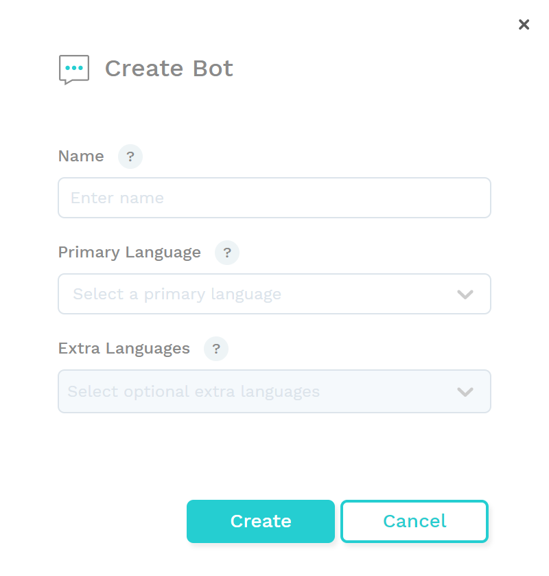

# Creating a new bot

_Are you working on an existing project? Then you don't need to set up a new one. Feel free to skip ahead to the next tutorial:_



## Creating a new bot

What better way to learn how to build a bot than building one! To help you get started, we'll go through a bot-building tutorial together. In this tutorial, you will create a bot called Choo Choo: a digital assistant that can help people book train tickets. 


To get started, you need valid log-in credentials to access the Chatlayer platform. Don't have them yet? Please request them [here](https://www.chatlayer.ai/contact).


1.Go to [https://app.chatlayer.ai/](https://app.chatlayer.ai/) and log in using your credentials

2. To build a new bot, click the blue `+ Add bot` button:

3. Choose "Start from scratch". You can add template bots to your account later.

4. Now enter `Choo Choo + your first name` as the name of the bot, so you can easily find it again after

5. Then select your primary language. This is the language that your bot will use. If you'd like to create a multilingual bot, you can add extra languages.

6. Now click `Create` to create your new bot!

## Creating bot dialogs

1.In the menu on the left, click on `Bot dialogs`

2. Then go to the `General`flow by clicking the blue flow icon:


**Flows** are a way to group bot dialogs that are about the same topic or use case. You will learn more about them later.


3. In the 'general' flow, you will see an overview of all the bot dialogs that are part of this flow. When creating a new bot, you always start with a few predefined dialogs:

* Not understood
* Introduction
* Offloading open
* Offloading closed
* Bot disabled
* Error occurred
* ...


To navigate the screen, you can zoom in or out by using the scrolling wheel, or by zooming with your laptop's trackpad. You can also click and drag to move through the dialog tree.


## Step 1: Adding an introduction

The first thing you'll need to do is create an introduction. This is the first message your users will  see, the dialog your bot will use to introduce itself and help users understand its functionalities. Introductions are an important way to set the proper expectations of a bot.

* You can edit the introduction by clicking the `introduction` bot dialog.


**What is a bot dialog?** A bot dialog is a something that the bot will say or do when triggered by a user [intent](https://docs.chatlayer.ai/understanding-users/natural-language-processing-nlp#intent) or user message. This can be anything: from a message to a user to connecting to an external system, giving a message back and jumping to a different dialog in the flow. We will come back to the [four different types ](https://docs.chatlayer.ai/bot-answers/dialog-state)of bot dialogs. 



Chatlayer.ai supports multiple media types. Depending on the channel your bot will use \(Facebook, Slack, Skype, Google Home, ...\) these will be rendered slightly differently.  For now that is not a problem, but check out [this page](https://docs.chatlayer.ai/channels/multi-channel/) when you start building your 'real' bot.


Since this is our first bot and our first message, let's start with a simple text message:

* Delete the predefined greeting message by selecting the following text:

> Hello. Please configure the introduction dialog state with a meaningful message.

* Replace it with the following text:

> Hello there! My name is Choo Choo, a digital assistant that will keep you on track.

* Click on `Text`  in the section 'Add bot message' to add a second message and enter the following text:

> How can I help you today?

The result will be:

Just like in normal conversations, your users will find it weird if your bot always replies with the exact same message. That's why we support random messages. A random message means that the different messages will be alternated, so sometimes the first message will show, sometimes the second one.

In the Text Message block, you can add multiple versions of the same message. The bot will randomly pick one of these messages to show to the user, making your dialogue more natural and human-like.

* To add a random message, click on  `+ Add random message` and enter the following text: _"What can I do for you?"_

Tip: you can add as many random messages as you like. 

* Click on `Save` to save your `introduction` bot dialog.

## Step 2: Testing your greeting

Time to check if we configured everything correctly. You can test your bot by using our built-in emulator.

* Click on the Emulator icon in the lower right corner to test your bot:

If you have configured everything correctly, Choo Choo will now start the conversation with the introduction you just created.   
  
_PS: You can ignore the debug button on the left for now, though this will be useful a little later, when you want to debug more complicated flows._

Congrats, you just created your first bot dialog! 🥳

## Lesson recap

You now have the done the following:

* Created your own tutorial bot
* Changed the introduction message
  * Added a new message and a random message

You should now know:

* How to change a bot message
* What the emulator is, and how to check your bot message in the emulator


In the [next tutorial](tutorial-adding-content.md), you will learn to set up questions which the user may ask the bot, and how to create a bot response.


