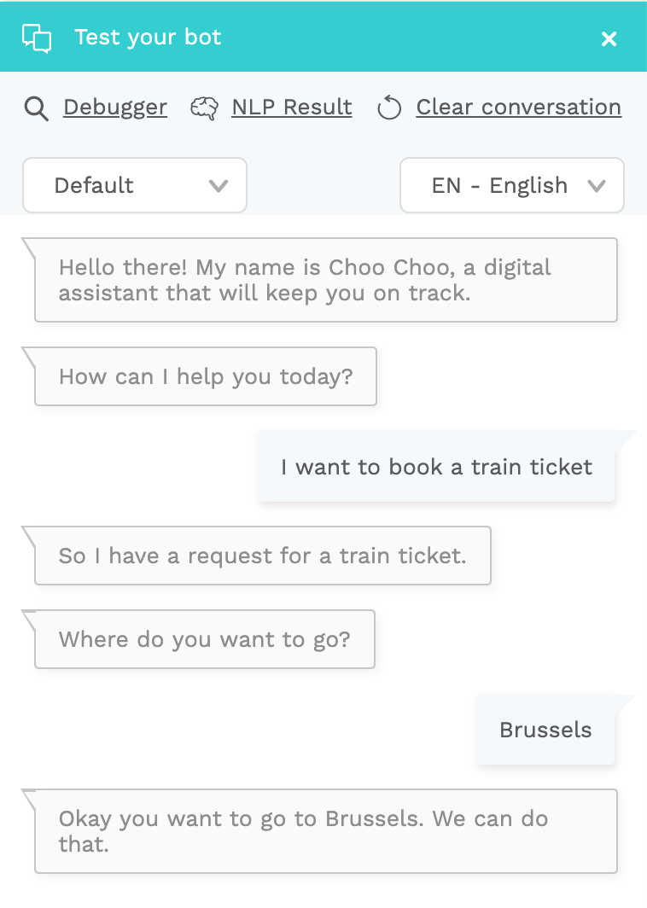

# Get data with an input validation

So far, our content was limited to a simple conversation. But in a lot of cases, the bot needs input from the user to fully fulfil their flow. That input can then be used later in the flow, or you can send it to the database using the API plugin.

### Adding an Input Validation

In our Choo Choo tutorial, the user wants to book a train ticket. But before we can do that, we need more information from our user:

* Destination?
* Origin?
* First class or second class?

## Text input

Let's start by asking for the departure location.

* Open the `book train ticket` bot dialog
* In the Bot Message tab, click the green + icon at the bottom to add a Go to
* Type `destination` in the Go to field, and click `Create Input Validation 'destination'`

* Save the `book train ticket` bot dialog
* Open the newly created `destination` input validation
* In the `Input Validation` tab, under 'Question', add a new text message "Where do you want to go?"
* In the Validation pane, select `Any` as the format type


Input validation can automatically detect certain types of data, like dates, addresses, numbers, hours, currencies, ... This will convert the users response into a more structured format. 

In this example, we just want to know the city of destination, which can take on any format. So, we'll use input type 'Any' which will accept any value as valid input. 

You can find more info about plugin parser types [here](../bot-answers/dialog-state/user-input-bot-dialog.md#input-types).


* Type `destination` as the variable. The input from each user will be saved under this variable
* Type `Confirm booking` in the 'Go to' field. Because the `Confirm booking` bot dialog doesn't exist, you get the option to create a new one. Pick `Create Bot Message 'Confirm booking'`

The end result should look like this:

Once created you will see the following flow:


The parent-child relation between dialog state nodes is only a visual representation, it has no functional meaning. Always link your bot dialogs using Go to's.


#### Using input in text messages

All the session variables are stored in the user session. To access a variable in any displayed text, you can put the variable name between curly brackets.

* Open the `Confirm booking` bot dialog
* Enter a new text message `Okay you want to go to {destination}. We can do that.`

#### NLP & input plugin

You want to make sure your users don't get stuck in a loop where the bot keeps asking them for input. That's why we make sure that if an intent is detected in the answer to the input plugin, users automatically leave the input plugin and go to the relevant part of the conversation.

Our Choo Choo bot doesn't have a mature NLP model yet, which increases the likelihood of false intent matches. So for now, it's best to select the 'Disable NLP' checkbox in the input plugin.

Time for a test!


If you forget to define the 'Go to' and you test your conversation flow, the flow will just stop. The conversation will only continue if you correctly set the 'Go to' for each dialog state.


### Adding remaining input validations

Repeat the previous steps for the the other pieces of information you'd like to get from your users:

* Origin: Where are you leaving from?
* Departure time: At what time do you want to leave?
* Departure date: Which day do you want to take the train?

Make sure all of these input validations follow a consecutive flow, and end up in the `Confirm booking` bot dialog:

1. `Book train ticket`
2. `Destination`
3. `Origin`
4. `Departure time`
5. `Departure date`
6. `Confirm booking`

### Combining input plugins with buttons

In the tutorial above, we requested user input by sending a text message. However, in an input validation, we can also ask for the user's input by click, but it is also possible to use buttons, lists, carousels and other UI components to support user input as text or clicks.

Let's use a carousel component to request the user their preferred train class.

* In the `Departure date` input validation, type `Class` in the Go to field and create a new input validation
* Under Question, add Buttons
* Enter the text message: "Which class do you want to travel in?"
* Add two buttons, "First class" and "Second class," both going to the `Confirm booking` bot dialog
* In both buttons add a variable `class` and value `first` and `second`

* Select format type `Any`, enter `class` as variable, and go to `Confirm booking`


It's important to use an identical variable name for the input variable, the NLP entity and the button variable.


Depending on the user input, different actions will be executed:

1. If a user writes an expression that contains an entity that matches with the variable in an input validation, this input validation is skipped. This way we can avoid asking things from the user which they've already said. 
   1. For example: when the user says `I need a first class train ticket` which belongs to intent `book train ticket` and includes an entity `class`, the 'class' variable is stored in the user session with a value 'first' and the input validation 'class' is skipped because the value for the input variable is already available in the user session.
2. When the user is asked to give his preferred train class and he says 'first', this value will be added in the input variable 'class' in the user session.
3. When the user clicks the button 'First class', the value 'first' will be added to the variable 'class' in the user session.

### Finishing up

Now that you have all this extra information, it's time to show all the data you've gathered in the input validations to the user:

* Open the `Confirm booking` bot dialog
* Replace the existing text message with "I have a train ticket for you from {origin} to {destination} on {departure date} at {departure time}h, in {class} class."

Now test your newly created bot to see if it works!

In the [next tutorial](tutorial-using-context-for-intent-reuse.md), you will learn how we can use context for re-using intents. A good example are **yes** and **no**, which can be used in association with more than one specific bot dialog.

