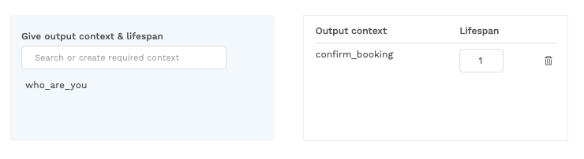

# Reusing intents with context


Context can be used to reuse intents across several bot dialogs. Learn more about the concept of context [here](https://docs.chatlayer.ai/understanding-users/using-context).


So, you've created the following two intents:

* General\_yes: this indicates that the user agrees with the bot
* General\_no: this indicates that the user disagrees with the bot

Now let's have a look at our Choo Choo bot. 

The user will respond with either **yes** or **no** here.

Then later in the conversation, at the end of the `Book train ticket` flow, the chatbot asks the user to confirm their booking info:

Both of these bot questions can be answered by the user with **yes** or **no**. To support the correct reuse of intents, we can link specific bot dialog intents to a specific context. The user will only be redirected to the linked bot dialog if the intent is recognized with a specific context.

* Add a `yes` and `no` intent and add a few expressions
* Go to the bot dialog `Confirm booking` and click on the NLP tab
* There, add the **output context** `confirm_booking`. Now press enter to create this output context
* When a user reaches this bot dialog the output context is added to the user session context


For each user message, the lifespan of a context is decreased by one. A user can have multiple contexts with different lifespan values.


* Add the `Confirmed Booking` **bot dialog** with **required context** `confirm_booking` and **intent** `yes` in the NLP tab. When the `yes` intent is returned by the NLP model and the user has the context `confirm_booking`, he will be redirected to this bot dialog. 


When multiple intent and input context combinations are found, the user's context with the highest lifespan value is taken.


* Add the `Cancel booking` **bot dialog** with the **required context** `confirm_booking` and **intent** `no`
* Add **output context** `who_are_you` in the **bot dialog** `Who are you`

* Add the `Yes book ticket` **bot dialog** with **required context** `who_are_you` and **intent** `yes`
* Add the `No book ticket` **bot dialog** with **required context** `who_are_you` and **intent** `no`

## Testing the flow in the emulator

* Click on the Emulator tab to test your dialog flow. Ask your bot who they are:

* Go to the **debug mode** and select the first message in the messages list `who are you` to view the received information after sending this user message.

* The **context** `who_are_you` has been added to the user session with an initial **lifespan** value of `1` as you can see in the context section                                                     
* The user is redirected to the bot dialog 
* The NLP result section shows that the 'who are you' intent has been recognised as top scoring intent
* In the **Message Data** section, we see the message being sent by the bot as answer

* In the **User Session** section, we see the context list of the user with name and lifespan

The [next tutorial](tutorial-conditional-flow-navigation.md) will show you how to redirect the user to a specific bot dialog, depending on the conditions of the values in session variables.

