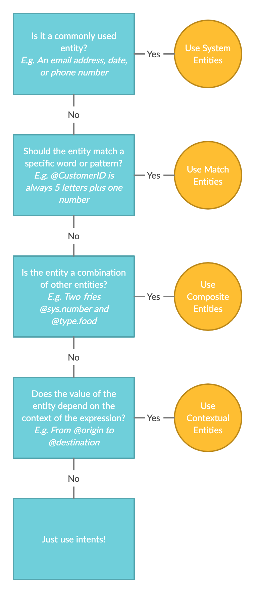

# Entities

## Types of entities

There are four types of entities:

* **Match entity:** if the user states a word that is part of a predefined list or matches a certain pattern, this word will be detected as a match entity. _For example: "I want to know more about the **Premium** pack"_ → _@product: Premium_ 
* **Contextual entity:** train your NLP so it can recognise entities that depend on the context of an expression. _For example: "Book a train ticket from **Brussels** to **Amsterdam"**_ → _****@origin: Brussels, @destination: Amsterdam_ 
* **System entity:** these are entities that are pre-built into the platform and can be detected automatically. _For example: "My e-mail address is **ilovebots@chatlayer.ai"**_ → _@sys.email: ilovebots@chatlayer.ai_ 
* **Composite entity:** a combination of different, but related entities _For example: "**Two** **fries** please"_ → _@order consists of @sys.number \(2\) and @foodItem \(fries\)_

### When to use which entity type?

Use this handy flowchart so you can find out which type of entity best fits your use case:


All entities are only detected after you've **updated the NLP** at least once. Every time you change, add, or delete an entity, you should update the NLP again


## 1 – Match entities

Match entities are a type of entity that is detected when the user states a word that is part of a predefined list, or matches a certain pattern.

### Option 1: Match text

Create a list of possible values for an entity. If a user mentions one of these values during their conversation with the bot, that value will automatically be saved as an entity.

For example: you have defined @product as a match entity, and have created three possible values: Basic, Intermediate, Premium. When a user says "I want to know more about the **Premium** pack", the entity @product will be saved, with the value "Premium".


Match entities are case insensitive, so there's no need to add the same word as a synonym but with a capital


#### Synonyms

For each value, you can add a synonym that will be detected as the original value. Synonyms allow you to add alternatives to entities that are assigned to the same value. 

For example:

`I want to go to Brussels`

`I want to go to Bruxelles`

The meaning of the two expressions above is exactly the same, but you want to convert `Bruxelles` to `Brussels` so your bot can work with one and the same value.

### Option 2: Match pattern

Use a pattern to extract data from a user expression if it matches a particular format. Patterns are formed as regular expressions \(like in Python\). You can learn more about how to create regular expressions [here](https://regex101.com/).

For example: you have defined **@customer\_ID** as a match entity, and have provided the following regex pattern: `[a-z]{5}[0-9]{2}`. This means that when a users says "My customer ID is **terwf33**", which consists of 5 letters and 2 numbers, it is saved as @customer\_ID with the value "terwf33".

Find a concrete example of how to use match entities below 👇



## 2 – Contextual entities

Contextual entities use the principle of machine learning to identify entities that are used in sentences. The NLP understands the entity by learning which type of word it is, where it's located in the sentence, and what the specific context around it is. You can also add [synonyms](./#synonyms) to contextual entities.


Contextual entities are the only type of entities that can \(and should be\) added to an expression itself, for example: "I want to book a train ticket from @origin to @destination"


You can see an example of how you can use contextual entities in our tutorial here:




When adding contextual entity variables, there's no need to add capitalised and non-capitalised words. All text is decapitalized by the NLP before any recognition happens, so 'api' won't be recognised differently from 'API' ​


### When to use contextual entities

Imagine you're a fruit seller who sells apples, pears, bananas and pineapples. Your chatbot can help people order fruit and ask for the price. Let's look at that pricing use case for apples. Some example expressions could be:

* How much is the price of apples?
* How much does an apple cost?
* What is the price of the apples?

Of course, these expressions could be asked for not just apples, but also pears, bananas, and pineapples. Does that mean you have to copy each expression and replace the fruit? No, you can just use contextual entities! 

Create a contextual entity called 'fruit' and add the following values to it:

* apple
* banana
* pear
* pineapple

In this case, we recommend to turn on fuzzy matching so that the bot will also recognise 'apples' and the plural of the other fruits. More info on fuzzy matching in the next section.

Now you can simply create an expression with the contextual entity in it:

* How much is the price of **@fruit**?
* How much does an **@fruit** cost?
* What is the price of the **@fruit**?

Now your bot will understand each expression, even if the fruit differs!

### Fuzzy matching for contextual entities

Fuzzy matching allows you to recognise a slight variation of an entity value \(or its synonym\) as the original value. For example "Brusselt" will be automatically corrected to "Brussels" if fuzzy matching is enabled.


Fuzzy matching is quite strict. Less than 20% of the characters are allowed to be different in order to link it to another entity. This is to avoid that the value is linked to another entity which also has overlap. 


## 3 – System entities

System entities are entities that can be automatically extracted from the user's messages. You can use these to enrich your conversations and data integrations without having to configure custom entities yourself.


You should never overwrite System Entities yourself – they are automatically overwritten by the last detected value \(if any values are detected\). So instead, copy the System Entity variable to a variable of your own choosing outside the **sys** or **internal** namespaces.


### Supported system entities

Chatlayer.ai supports the following system entity types:

| Variable name | Example input by user | Example result in session |
| :--- | :--- | :--- |
| `sys.email` | "ilovebots@chatlayer.ai" | `sys: {email: 'ilovebots@chatlayer.ai'}` |
| `sys.phone_number` | "+32 487 23 02 03" | `sys: {phone_number: '(+32) 487230203'}` |
| `sys.ordinal` | "5th" | `sys: {ordinal: '5'}` |
| `sys.amount_of_money` | "5 euro" | `sys: {amount_of money: '5', amount_of_money_currency: 'EUR'}` |
| `sys.distance` | "5 kilometers" | `sys: {distance: '5', distance_unit: 'kilometre'}` |
| `sys.number` | "eighty eight" | `sys: {number: '88'}` |
| `sys.quantity` | "3 liters" | `sys: {quantity: '3', quantity_unit: 'litre'}` |
| `sys.temperature` | "80C" | `sys: {temperature '80', temperature_unit: 'celsius'` |
| `sys.time` | "3 pm tomorrow" | `sys: {time: '2020-12-25T15:00:00.000+00:00', time_grain: 'hour'}` |
| `sys.url` | "[www.chatlayer.ai/jobs](https://www.chatlayer.ai/jobs)" | `sys: {url: 'www.chatlayer.ai/jobs', url_domain: 'chatlayer.ai'}` |
| `sys.duration` | "3 hours" | `sys: {duration: '3', duration_unit: 'hour', duration_normalized: '10800', duration_normalized_unit: 'second'}` |

## 4 – Composite entities

A Composite Entity is a combination of two or more different, yet related entities. This type of entity allows you to combine two separate entities into a single one.

Let's look at an example. When a user tells the bot "Two fries please", the bot will understand this as the predefined composite entity **@order**_,_ which consists of two separate entities: 

* **@sys.number:** 2, a system entity
* and **@foodItem**: fries, a match entity which is predefined 

### Using a go to with composite entities

Here's an example use case to illustrate how to use a go to dialog for composite entities:

* You created a composite entity named @car\_info, made up of the following two entities: @car\_brand and @sys.number
* @car\_brand is a match entity that checks if the user's car brand is part of a predefined list of car brands. @sys.number captures the year the user got their car in
* Next, you created an input validation to ask the user for their car brand \(@car\_brand\) and the year they got their car in \(@sys.number\)

The input validation dialog looks like this:

* Next, you want to use a go to dialog to check if the car is a green car. 
  * When the year is equal to or more than 2016, the car is a green car
  * When the year is less than 2016, the car is not a green car
* To set this up, you only need one of the two entities that make up the composite entity. The @car\_brand doesn't matter in this case, you only want @sys.number
* If you would enter @sys.number as a variable, the set up wouldn't work because it's a predefined platform entity. You want the @sys.number that was part of the composite entity
* To grab this entity, you need to use: car\_info.sys.number

The go to dialog looks like this:

## The difference between entities, variables, and values

**A value is a possible element of a variable or entity.** For example, the variable 'destination' can have the following values: Antwerp, London, Brussels, ...

**An entity that was successfully recognized by the NLP engine will be stored as a variable.** For example, say you created the match text entity 'Levels' with values 'Beginner', 'Intermediate' and 'Expert'. When the user says 'I think I'm an expert', the value 'expert' will be saved as a variable. So a variable is an entity that was successfully recognized and stored by the chatbot.

**Variables are pieces of information you know about the person talking to the bot.** For example, if someone is talking to the bot in English, we will remember their preference and save 'English' as a value for the variable “Language”. **Variables and values always appear in pairs.** They are stored on the user session that gathers all information about a user.

**Entities should only be used if their value is needed in the bot conversations**. For example, if your bot can help the user find information about a certain product and you need the name of that product to look up the information in a database, you should use entities. If your bot simply redirects to a web page with an overview of all products, you do not need entities.

