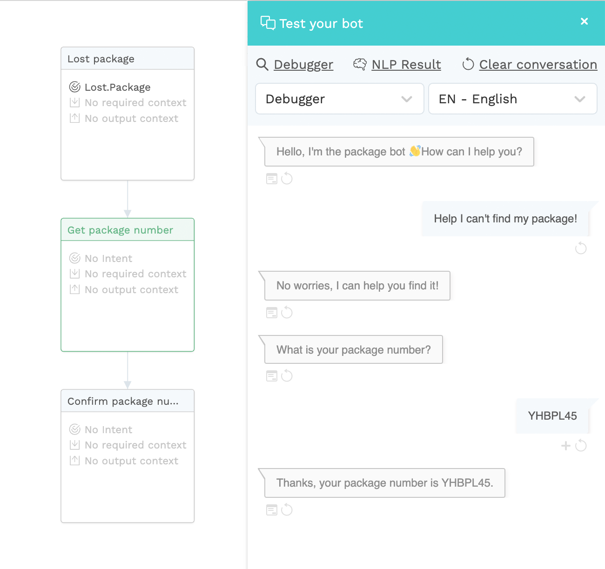
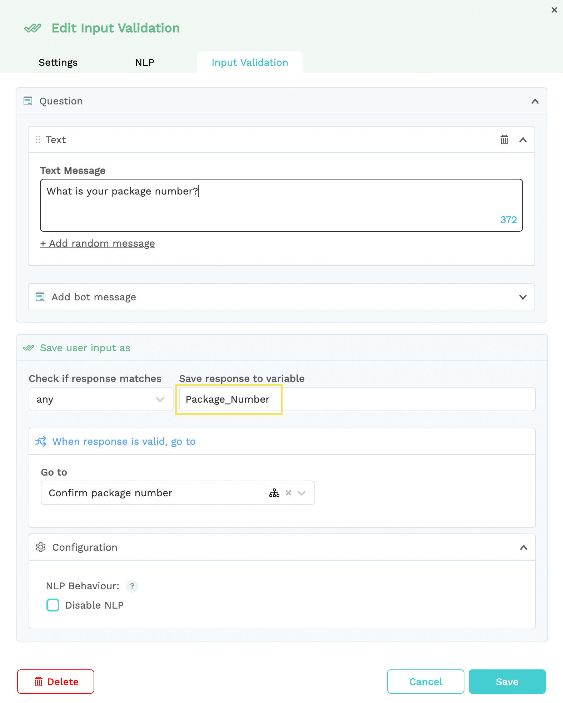
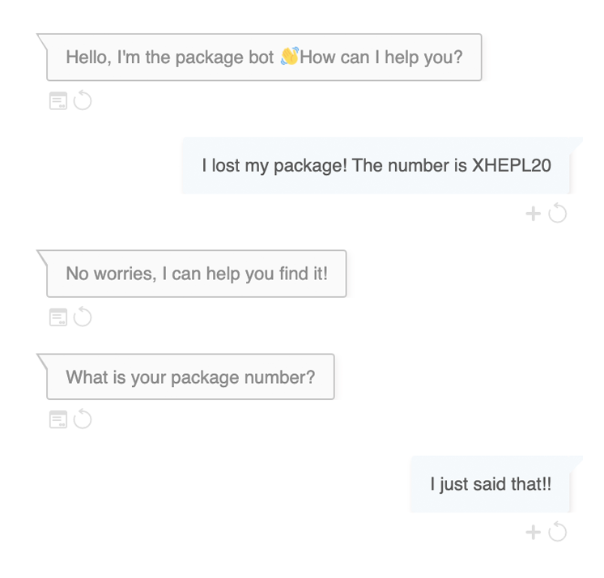
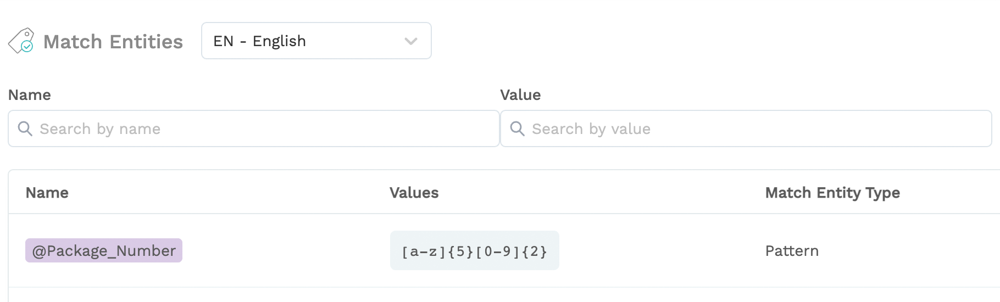
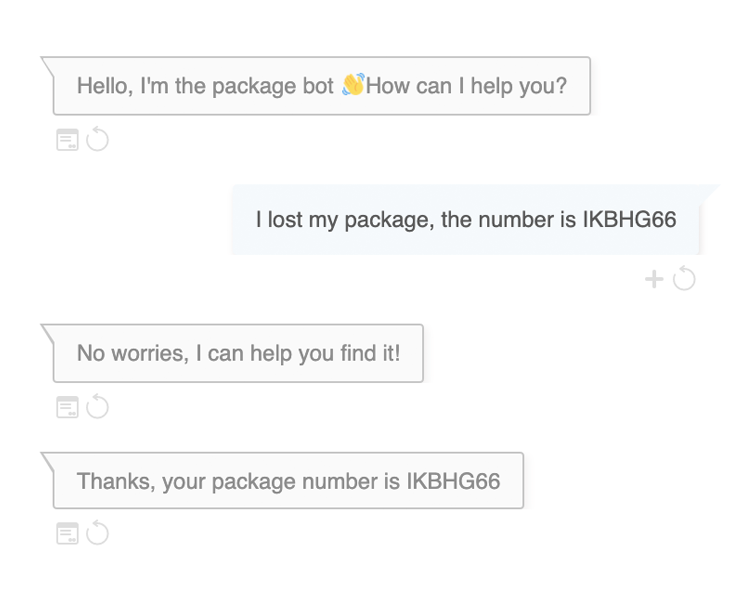

# Example of how to use match entities

On this page, we will show you a concrete example of how you can use match entities to detect information given by a user without explicitly asking for it. 

Let's get started! 

## 1 – Detecting information using entities

Imagine you're building an FAQ bot. One of the things it can do, is trace a lost package. For the bot to be able to track the lost package, it needs the package number. To get this number, the conversation would look like this: 

After the bot has recognised the `Lost.Package` intent, it displays the message in that dialog. Using a go-to in the same dialog, it automatically shows the second dialog, which is an input validation. In this dialog, it asks the user for their package number:

After the user gave their package number, the bot displays the third bot message to confirm the package number.

Now this works fine, but what if the user already gives the package number at the start? The way this current flow is set up, the bot would still ask for the package number because it follows the original flow of dialogs:

But good news: you can solve that using... **Match entities 🤩**

Knowing that a package number will always consist of 5 letters and 2 numbers, you can create a match entity called `@Package_Number` to detect this piece of information in a user's expression. And some more good news: You don't need to add special expressions, the bot will always recognise this specific entity because you have predefined it as an entity.


Don't forget to train your NLP after creating the entity so the bot can learn.


Now that you've created the entity and trained your NLP, let's look at our conversation again:

Because you predefined the package number as a match entity, the bot was able to pick up on it in the user's expression, therefore skipping the input validation step of asking for it. The result is a much better user experience and a seemingly smarter bot 😉

