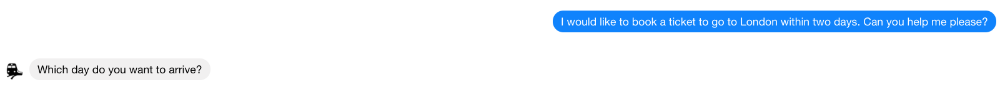
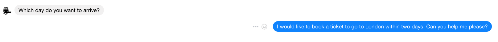
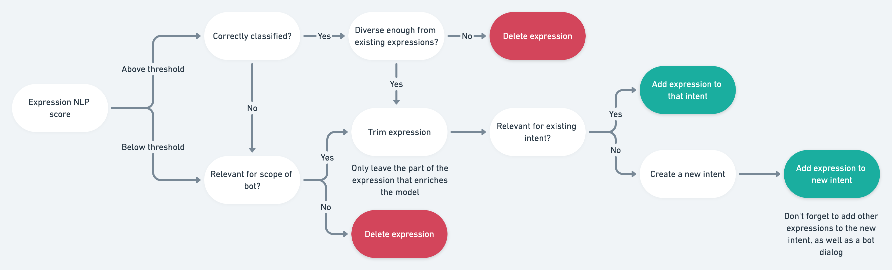

# Train your bot with actual user messages

Once you have a bot configured you want to train your NLP models with actual user messages so that your bot becomes smarter over time and support different kinds of expressions. For this you can use the NLP Train section.

* Let us first create some actual training data by talking to our bot on Facebook Messenger. If you haven't activated your bot on Facebook Messenger yet, follow the steps in the Channel wizard in the platform.


All conversations from your channels will be loaded into the Train module. Conversations from the emulator are ignored.


* Look at the train NLP section. As you can see the user messages has been labelled by the NLP model so that we can evaluate this message. It seems that our model has detected the correct intent and entity values.

* Click on '+' to add this candidate expression as validated expression.
* Let's do a second test by sending a new user message on Facebook Messenger.

* It seems that the entities are not recognised correctly.
* Adjust the expression by adding those entities, train and publish your model and test in the NLP test section. If needed add similar expressions to this intent.

To summarise this, we recommend using the following flow to analyse expressions coming directly from users in the Train tab:

There are a couple of things you should keep in mind when using the Train tab:

1. Expressions from the "Test your bot" window will not be included in the train tab
2. If two users write the exact same expression, it will only show up once in the train tab
3. If an expression from a user is an exact match with what is already included in your model as an expression, it is not included in the train tab.
4. In the "Score" column you will see the score of the NLP model at the time the expression was said. This might differ from the score that the current NLP model gives this expression.

